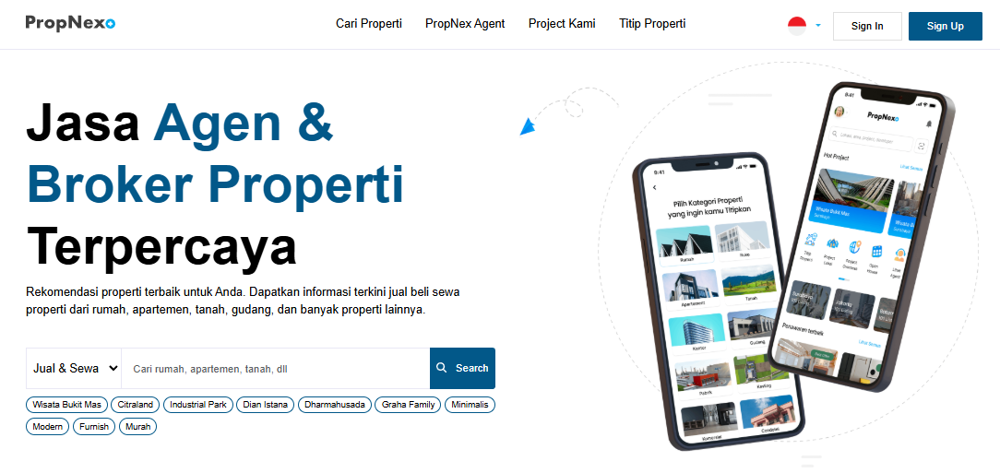

## Project Overview

PropNexPlus.com is a comprehensive real estate platform designed specifically for property agents to streamline their daily operations. The platform helps agents manage property listings, client interactions, and various real estate services including property search functionality, agent profiles, and integrated CRM tools for lead generation and customer relationship management.

## Daily Development Work & Key Contributions

Working on PropNexPlus has been an intensive full-stack development experience where I contributed to building a robust real estate management platform from the ground up.

### Backend Development & Database Architecture

My primary responsibility involved designing and implementing the core backend infrastructure using PHP frameworks including Laravel and CodeIgniter.

##### Key Backend Features I Developed

- **Property Listing Management System** – Built comprehensive CRUD operations for property data management
- **Search Engine Integration** – Implemented Elasticsearch for advanced property search capabilities with filters and geolocation
- **Database Pipeline Architecture** – Designed efficient data ingestion systems for continuous property data streams
- **REST API Development** – Created documented APIs for mobile and web client integration

##### Database & Search Implementation

- **Elasticsearch Integration** – Optimized search performance for large property datasets
- **Firebase Integration** – Implemented real-time notifications and data synchronization
- **Database Schema Design** – Structured relational and NoSQL databases for optimal performance
- **Data Compression & Optimization** – Enhanced system performance through efficient data handling

### Frontend Development & User Experience

Contributed to the user interface development focusing on agent productivity and client engagement features.

##### Frontend Technologies & Features

- **JavaScript & jQuery Implementation** – Built interactive property search interfaces
- **Responsive Design** – Ensured cross-device compatibility for mobile and desktop users
- **Image Processing System** – Developed property image upload and optimization features
- **SEO Optimization** – Implemented schema markup and search engine optimization strategies

### CRM & Customer Management Features

Developed comprehensive customer relationship management tools tailored for real estate operations.

##### CRM Functionalities I Built

- **Lead Management System** – Created lead tracking and conversion pipeline
- **Client Communication Tools** – Integrated messaging and notification systems
- **Agent Performance Analytics** – Built dashboard for tracking agent productivity metrics
- **Financial Analysis Tools** – Developed commission tracking and financial reporting features

### Technical Implementation & Code Quality

Maintained high code standards and implemented best practices throughout the development process.

##### Development Practices

- **Object-Oriented Programming** – Applied OOP principles for maintainable and scalable code
- **Code Refactoring** – Continuously improved codebase performance and readability
- **Git Version Control** – Managed collaborative development with proper branching strategies
- **API Documentation** – Created comprehensive documentation using Postman for all endpoints

## Technical Stack & Tools

The project utilized a modern technology stack optimized for real estate industry requirements:

- **Backend**: PHP, Laravel, CodeIgniter
- **Database**: MySQL, Firebase, Elasticsearch
- **Frontend**: JavaScript, jQuery, HTML5, CSS3
- **Tools**: Git, Postman, Firebase Console
- **Search**: Elasticsearch with custom analyzers
- **CMS**: Custom content management system

## Project Impact & Results

PropNexPlus has successfully streamlined property agent workflows by providing:

- **Enhanced Search Capabilities** – Agents can quickly find relevant properties using advanced search filters
- **Improved Client Management** – Comprehensive CRM tools have increased lead conversion rates
- **Real-time Data Processing** – Continuous data streams ensure up-to-date property information
- **Scalable Architecture** – Platform handles growing user base and increasing property datasets

> Working on PropNexPlus has provided me with extensive experience in building enterprise-level real estate solutions, combining advanced search technologies with user-friendly interfaces to create a platform that truly enhances property agent productivity and client satisfaction.

The project continues to evolve with new features and optimizations based on user feedback and industry requirements.
