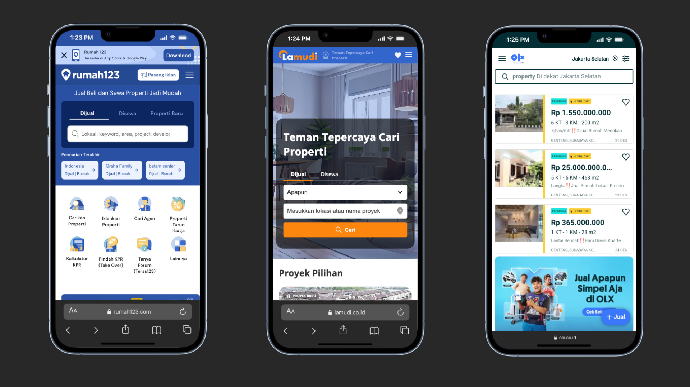

## Project Overview

The PropNex Plus Multi-Platform Integration System is a strategic partnership initiative rebuilding PropNex Indonesia's property distribution infrastructure to connect with three major Indonesian property portals: **rumah123**, **lamudi**, and **OLX**. This enterprise-level integration platform enables PropNex agents with premium/paid accounts to automatically distribute their property listings across all three platforms simultaneously, exponentially increasing property visibility and lead generation potential. Built with Laravel and powered by robust API integration architecture, the system implements sophisticated account validation, automated listing synchronization, and comprehensive vendor API management, positioning PropNex Indonesia as a technologically advanced real estate leader in the Indonesian market.

## Business Context & Strategic Challenge

### PropNex Indonesia's Digital Expansion Need

**What is PropNex Plus?**

PropNex Plus is PropNex Indonesia's premium agent management and listing platform, serving hundreds of real estate agents across Indonesia. Agents use the platform to manage their property listings, client relationships, and business operations. However, listings were previously confined to PropNex's own channels, limiting market reach and lead generation potential.

**Market Challenge: Limited Listing Visibility**

Before this integration project, PropNex agents faced:

- **Manual Multi-Platform Posting** – Agents manually posting the same property to multiple portals
- **Time-Consuming Duplication** – Hours spent copying listing details across platforms
- **Inconsistent Information** – Data discrepancies between different platforms
- **Missed Opportunities** – Listings not reaching audiences on major property portals
- **Premium Feature Gap** – No differentiation between free and paid agent accounts
- **Competitive Disadvantage** – Other agencies offering automated multi-platform distribution

### Project Objectives

Rebuild PropNex's partnership program to:

- **Automate Multi-Platform Distribution** – One-click listing syndication to rumah123, lamudi, and OLX
- **Premium Account Validation** – Ensure only paid/premium agents access multi-platform integration
- **Seamless API Integration** – Establish robust connections with all three vendor APIs
- **Real-Time Synchronization** – Keep listings updated across all platforms simultaneously
- **Vendor Partnership Management** – Build technical relationships with major property portals
- **Scalable Architecture** – Design system to accommodate future platform integrations

### Target Platform Partnerships

**rumah123 Integration**

- Indonesia's leading property portal with millions of monthly users
- Comprehensive API for residential and commercial properties
- Advanced search and lead generation features
- Premium placement and featured listing options

**lamudi Integration**

- Major international property platform with strong Indonesian presence
- RESTful API supporting full property lifecycle management
- Multi-language support and international buyer reach
- Professional real estate agent verification system

**OLX Integration**

- Largest classified ads platform in Indonesia with massive reach
- Simple API for quick listing distribution
- Free and premium listing tiers
- High traffic volume and broad demographic reach

### Key Stakeholders

**PropNex Premium Agents**

- 200+ agents with paid/premium accounts
- Need maximum listing visibility across multiple platforms
- Require time-saving automation for listing management
- Expect seamless, reliable multi-platform distribution

**PropNex Management**

- Strategic partnership development team
- Revenue protection through premium account validation
- Platform integration and vendor relationship management
- Business intelligence and listing performance analytics

**External Vendor Partners**

- rumah123 technical team and API support
- lamudi partnership and integration team
- OLX developer relations and API access
- Ongoing API maintenance and version updates

## Technical Architecture & Integration Stack

Enterprise-grade integration platform with robust API management and premium account validation.

### Core Technology Stack

- **Backend Framework**: Laravel 10 with service-oriented architecture
- **API Integration Layer**: RESTful API clients for multi-vendor connections
- **Database**: MySQL with optimized schema for listing synchronization
- **Queue System**: Laravel Queue with Redis for asynchronous processing
- **Caching Layer**: Redis for API response caching and rate limit management
- **Authentication**: OAuth 2.0 and API key management for vendor APIs
- **Monitoring**: Real-time API health monitoring and error tracking
- **Logging**: Comprehensive API call logging and audit trails
- **Testing**: Automated API integration testing and mock services

### System Architecture

**Multi-Vendor API Integration**

- **rumah123 API Client** – Laravel service class for rumah123 RESTful API
- **lamudi API Client** – Dedicated integration layer for lamudi endpoints
- **OLX API Client** – OLX classified ads API integration service
- **Unified Interface** – Abstract base class for consistent API interactions
- **Error Handling** – Retry logic, fallback mechanisms, and graceful degradation
- **Rate Limiting** – Respect vendor API rate limits with queue throttling

**Premium Account Validation System**

- **Account Tier Detection** – Middleware to verify agent subscription status
- **Feature Gating** – Multi-platform distribution restricted to premium accounts
- **Grace Period Management** – Handle subscription expirations and renewals
- **Usage Tracking** – Monitor integration usage per agent account
- **Upgrade Prompts** – Notify free users about premium integration benefits

**Listing Synchronization Engine**

- **Change Detection** – Track listing modifications in PropNex Plus
- **Batch Processing** – Queue-based batch updates to vendor platforms
- **Conflict Resolution** – Handle discrepancies between platforms
- **Status Tracking** – Monitor listing status across all platforms
- **Rollback Capability** – Revert failed synchronizations

### API Integration Architecture

**Vendor API Communication Flow**

1. **Agent Creates/Updates Listing** in PropNex Plus
2. **Premium Validation** checks agent subscription status
3. **Data Transformation** converts PropNex format to vendor formats
4. **Queue Dispatch** sends listing to integration queue
5. **API Calls** asynchronously post to rumah123, lamudi, OLX
6. **Response Handling** processes success/failure for each platform
7. **Status Update** reflects sync status in PropNex Plus dashboard

**Data Mapping & Transformation**

- **Field Mapping Tables** – PropNex fields to vendor-specific requirements
- **Image Optimization** – Resize/compress images per platform specifications
- **Category Translation** – Map PropNex property types to vendor taxonomies
- **Price Formatting** – Currency and price display per platform standards
- **Location Normalization** – Standardize address formats for each vendor

**Error Handling & Resilience**

- **Retry Strategies** – Exponential backoff for failed API calls
- **Dead Letter Queue** – Capture permanently failed integrations
- **Alert System** – Notify admins of critical integration failures
- **Manual Retry Interface** – Dashboard for reprocessing failed listings
- **API Status Dashboard** – Real-time health monitoring of all vendor APIs

## Comprehensive Feature Set by Platform Integration

Sophisticated integration capabilities tailored to each property portal's API requirements.

### rumah123 Integration Features

**Property Listing Management**

- **Full CRUD Operations** – Create, read, update, delete listings via rumah123 API
- **Property Types Support** – Houses, apartments, land, commercial properties
- **Rich Media Upload** – Multiple images, floor plans, virtual tour links
- **Featured Listings** – Premium placement and highlighting options
- **Location Precision** – GPS coordinates and detailed address mapping
- **Property Specifications** – Bedrooms, bathrooms, land size, building size

**Agent Profile Integration**

- **Agent Verification** – Sync PropNex agent credentials to rumah123
- **Contact Information** – Automated agent contact detail updates
- **Agency Branding** – PropNex logo and branding on all listings
- **Performance Metrics** – Sync listing views and lead statistics back to PropNex

**Advanced Features**

- **Lead Capture** – Retrieve inquiry data from rumah123 to PropNex CRM
- **Status Synchronization** – Auto-update listing status (sold, rented, available)
- **Price Updates** – Real-time price change synchronization
- **Listing Expiration** – Automated renewal or removal of expired listings

### lamudi Integration Features

**International Reach**

- **Multi-Language Support** – English and Bahasa Indonesia listing versions
- **International Buyer Features** – Currency conversion and international contact
- **Professional Verification** – PropNex agency verification badges
- **Premium Agent Profiles** – Enhanced agent profiles with PropNex branding

**Property Data Sync**

- **Comprehensive Property Details** – All property attributes and amenities
- **Neighborhood Information** – Nearby facilities and infrastructure details
- **Investment Information** – ROI calculations and rental yield data
- **Legal Documentation** – Property certificate and legal status information

**API-Specific Features**

- **Batch Upload Support** – Efficient multi-listing synchronization
- **Webhook Integration** – Real-time notifications from lamudi to PropNex
- **Analytics Integration** – Listing performance data and viewer insights
- **Search Optimization** – SEO-friendly listing data for better visibility

### OLX Integration Features

**Classified Ads Distribution**

- **Quick Listing Publishing** – Fast property posting to OLX classifieds
- **Free & Premium Tiers** – Support for both OLX listing types
- **Category Mapping** – Proper property category classification
- **Contact Privacy** – OLX contact masking and lead forwarding

**High-Volume Reach**

- **Broad Demographics** – Access to OLX's massive user base
- **Mobile-First Optimization** – Listings optimized for OLX mobile app
- **Simple Listing Format** – Streamlined property information for quick browsing
- **Featured Ads** – Premium ad placement for better visibility

**OLX-Specific Features**

- **Chat Integration** – OLX chat system for buyer inquiries
- **View Counter** – Track listing view statistics from OLX
- **Auto-Renewal** – Automatic listing bumping for continued visibility
- **Safety Features** – OLX safety tips and verification badges

### Cross-Platform Unified Features

**Premium Account Filtering**

- **Subscription Verification** – Real-time check of agent subscription status
- **Access Control** – Block integration for non-premium accounts
- **Upgrade Prompts** – Encourage free users to upgrade for multi-platform access
- **Grace Period Handling** – Temporary access during payment processing
- **Usage Analytics** – Track which premium agents use which platforms

**Centralized Dashboard**

- **Multi-Platform Status View** – Single dashboard showing listing status on all platforms
- **Sync Status Indicators** – Visual indicators for successful/failed syncs
- **Platform-Specific Performance** – Compare listing performance across portals
- **Bulk Actions** – Publish/unpublish to multiple platforms simultaneously
- **Error Notifications** – Real-time alerts for integration issues

**Automated Synchronization**

- **One-Click Publishing** – Publish to all platforms with single action
- **Auto-Update Propagation** – Changes in PropNex Plus auto-sync to all platforms
- **Scheduled Sync** – Daily synchronization checks for consistency
- **Conflict Resolution** – Smart handling of platform-specific data conflicts
- **Sync History** – Audit log of all synchronization activities

**Data Consistency Management**

- **Master Data Source** – PropNex Plus as single source of truth
- **Bidirectional Sync** – Pull lead data and statistics from platforms
- **Data Validation** – Ensure listings meet all platform requirements before publishing
- **Image Processing Pipeline** – Automatic image optimization per platform specs
- **Duplicate Prevention** – Prevent duplicate listings on same platform

## Vendor Partnership & API Collaboration

Demonstrating professional vendor relationship management and technical collaboration capabilities.

### API Documentation & Research Phase

**rumah123 API Study**

- **API Documentation Review** – Thorough analysis of rumah123 developer docs
- **Authentication Method** – OAuth 2.0 implementation and token management
- **Endpoint Mapping** – Catalog all required endpoints for CRUD operations
- **Data Schema Analysis** – Understand required fields and data formats
- **Rate Limits** – Identify API call limits and design respectful usage patterns
- **Sandbox Testing** – Test environment setup and initial integration trials

**lamudi API Integration Planning**

- **RESTful API Structure** – Study lamudi's API architecture and conventions
- **Property Taxonomy** – Map PropNex categories to lamudi's classification system
- **Image Requirements** – Understand image size, format, and quantity limits
- **Localization Needs** – Plan for multi-language support and currency handling
- **Webhook Configuration** – Set up callback URLs for real-time updates
- **API Versioning** – Ensure compatibility with current and future API versions

**OLX API Compatibility**

- **Classified Ads API** – Integrate with OLX's simpler classifieds-focused API
- **Category Structure** – Map property types to OLX classified categories
- **Contact Privacy** – Implement OLX's contact masking and forwarding
- **Mobile Optimization** – Ensure data formats work well in OLX mobile app
- **Featured Ads API** – Integrate premium placement options
- **Chat System** – Plan for OLX chat integration and lead capture

### Technical Meetings & Vendor Collaboration

**Demonstrated Professional Capabilities**

- **Technical Presentations** – Present PropNex integration architecture to vendor teams
- **API Requirement Gathering** – Discuss custom needs and special use cases
- **Partnership Negotiation Support** – Provide technical input for partnership terms
- **Integration Timeline Planning** – Collaborate on realistic rollout schedules
- **SLA Discussion** – Understand and commit to service level agreements
- **Support Channel Setup** – Establish technical support contacts and escalation paths

**Cross-Functional Collaboration**

- **PropNex Business Team** – Align technical capabilities with business objectives
- **Vendor Partnership Managers** – Bridge technical and business discussions
- **Vendor Developer Relations** – Work directly with vendor technical teams
- **PropNex Product Team** – Incorporate feedback into PropNex Plus features
- **Quality Assurance** – Coordinate testing efforts with all stakeholders

### API Compatibility & Standards Compliance

**RESTful API Best Practices**

- **HTTP Methods** – Proper use of GET, POST, PUT, DELETE per REST standards
- **Status Codes** – Correct interpretation and handling of HTTP status codes
- **JSON Formatting** – Consistent JSON request/response structure
- **Error Handling** – Parse and handle vendor-specific error formats
- **Authentication** – Secure OAuth 2.0 and API key management
- **HTTPS Encryption** – All API communications over secure connections

**Data Format Compatibility**

- **Date/Time Formats** – ISO 8601 standardization across all platforms
- **Currency Handling** – Indonesian Rupiah (IDR) formatting per vendor specs
- **Address Formats** – Platform-specific address structure requirements
- **Phone Numbers** – International format with proper country codes
- **Image URLs** – HTTPS URLs with proper CORS headers
- **Character Encoding** – UTF-8 support for Indonesian language characters

**API Integration Testing**

- **Unit Tests** – Test individual API client methods
- **Integration Tests** – Test end-to-end listing synchronization flows
- **Mock Services** – Create vendor API mocks for development/testing
- **Sandbox Environment** – Use vendor sandbox APIs before production
- **Load Testing** – Verify system handles high-volume synchronization
- **Error Scenario Testing** – Test all failure modes and recovery processes

## Professional Skills Demonstrated

Comprehensive technical and business capabilities showcased through this enterprise integration project.

### Technical Competencies

**API Integration Expertise**

- Third-party RESTful API integration and management
- OAuth 2.0 authentication and token lifecycle management
- API client architecture with service-oriented design
- Error handling, retry logic, and resilience patterns
- Rate limiting and request throttling strategies
- Webhook integration for real-time event handling

**Backend Development**

- Laravel 10 enterprise application development
- Queue-based asynchronous processing with Redis
- Database schema design for multi-platform synchronization
- Caching strategies for API performance optimization
- Service layer architecture for clean code separation
- Comprehensive logging and monitoring implementation

**Data Integration & Transformation**

- Complex data mapping between different schemas
- Field transformation and normalization logic
- Image processing and optimization pipelines
- Multi-format data validation and sanitization
- Conflict resolution algorithms for data inconsistencies
- Batch processing for high-volume synchronization

**Premium Account System**

- Subscription-based access control implementation
- Middleware for feature gating and authorization
- Payment integration and subscription management
- Grace period and renewal handling logic
- Usage analytics and reporting for business intelligence

### Vendor Collaboration & Partnership Management

**Professional Communication**

- Technical presentations to external vendor teams
- API requirement documentation and specifications
- Partnership proposal creation and technical support
- Cross-functional collaboration with business teams
- Technical support coordination and escalation management

**Vendor Relationship Building**

- Establishing direct relationships with rumah123 technical team
- Negotiating API access and integration terms with lamudi
- Coordinating with OLX developer relations for API onboarding
- Building trust through professional conduct and reliable integration
- Long-term partnership maintenance and version migration planning

**Business-Technical Bridge**

- Translating business requirements to technical specifications
- Explaining technical constraints to business stakeholders
- Proposing technical solutions aligned with business objectives
- ROI analysis for integration investments
- Strategic planning for future platform expansions

### PropTech & Real Estate Domain Knowledge

**Property Listing Standards**

- Understanding property types, categories, and taxonomies
- Real estate listing best practices and SEO optimization
- Image requirements and virtual tour integration
- Lead generation and CRM integration patterns
- Property market dynamics and agent workflows

**Indonesian Property Market**

- Major property portals landscape and competitive positioning
- Local property listing regulations and standards
- Indonesian language and currency handling
- Regional property market trends and buyer behavior
- Real estate agent business models and pain points

### Software Engineering Best Practices

**System Architecture**

- Service-oriented architecture for maintainability
- Queue-based asynchronous processing for scalability
- Caching and optimization for performance
- Monitoring and observability for reliability
- Security best practices for API key management

**Code Quality & Maintenance**

- Clean code principles and SOLID design patterns
- Comprehensive error handling and logging
- Unit and integration testing for reliability
- API versioning for backward compatibility
- Documentation for maintainability and knowledge transfer

**DevOps & Reliability**

- Queue worker management and supervision
- API health monitoring and alerting
- Performance optimization and bottleneck identification
- Scalability planning for growing agent base
- Disaster recovery and data backup strategies

## Why This Project Matters for HR Evaluation

### Demonstrates Enterprise-Level Integration Capabilities

This project proves expertise in:

- **Multi-Vendor API Integration** – Successfully connecting with three major platforms simultaneously
- **Complex Data Synchronization** – Real-time listing distribution across different systems
- **Premium Business Logic** – Sophisticated account validation and access control
- **Scalable Architecture** – Queue-based processing handling hundreds of agents and thousands of listings
- **Real-World Business Impact** – Directly increasing agent productivity and lead generation

### Shows Vendor Partnership & Collaboration Skills

The project highlights ability to:

- **Build Technical Partnerships** – Establish working relationships with rumah123, lamudi, and OLX technical teams
- **Navigate Vendor APIs** – Quickly learn and integrate with different API architectures and standards
- **Professional Communication** – Present technical proposals and collaborate with external stakeholders
- **Cross-Functional Work** – Bridge technical development with business partnership objectives
- **Long-Term Relationship Management** – Maintain integrations through API updates and version changes

### Highlights PropTech & Real Estate Industry Experience

Working in property technology demonstrates:

- **Domain Expertise** – Deep understanding of real estate listing workflows and agent needs
- **Market Knowledge** – Familiarity with Indonesian property portal landscape
- **Business Impact Focus** – Features directly tied to revenue (premium accounts) and agent success
- **Industry Best Practices** – Following property listing standards and optimization techniques
- **Competitive Advantage** – Building features that differentiate PropNex in the market

### Proves Technical Leadership & Strategic Thinking

The project showcases:

- **Rebuilding Legacy Systems** – Taking existing partnership program and modernizing architecture
- **Strategic Platform Selection** – Identifying and integrating with most impactful property portals
- **Revenue Protection** – Premium account filtering ensures proper monetization
- **Scalability Planning** – Architecture designed to accommodate future platform additions
- **Business-Technical Alignment** – Technical decisions driven by business objectives and agent needs

### Demonstrates Production-Ready Development

Quality indicators include:

- **Error Resilience** – Comprehensive error handling and retry mechanisms
- **Monitoring & Observability** – Real-time API health monitoring and alerting
- **Queue-Based Architecture** – Asynchronous processing for reliability and performance
- **Security Best Practices** – Secure API key management and OAuth implementation
- **Testing Strategy** – Unit tests, integration tests, and sandbox environment usage

> **For HR Professionals**: This enterprise integration project demonstrates a developer who can handle complex multi-vendor API integration while managing real business requirements like premium account validation and vendor partnerships. The ability to work with three major Indonesian property portals (rumah123, lamudi, OLX) simultaneously shows strong API integration skills, vendor relationship management, and PropTech domain expertise. This is the type of strategic technical project that directly impacts business revenue and competitive positioning, showcasing a developer who understands both technology and business value.

## Key Takeaways

### Core Competencies Demonstrated

- **Multi-Platform API Integration** – Simultaneous integration with rumah123, lamudi, and OLX
- **Enterprise Architecture** – Queue-based, scalable system handling hundreds of agents
- **Premium Account System** – Business logic ensuring only paid users access integrations
- **Vendor Partnership Management** – Professional collaboration with external technical teams
- **PropTech Expertise** – Real estate technology domain knowledge and industry best practices
- **Data Synchronization** – Complex listing synchronization across different platforms

### Technical Skills Showcased

- **Backend**: Laravel 10, Queue System, Redis, MySQL, Service Architecture
- **API Integration**: RESTful clients, OAuth 2.0, Webhook handling, Rate limiting
- **Third-Party APIs**: rumah123 API, lamudi API, OLX API integration
- **Data Processing**: Data mapping, transformation, validation, image optimization
- **Monitoring**: API health monitoring, logging, error tracking, alerting systems

### Professional Attributes

- **Vendor Collaboration** – Building relationships with major property portal technical teams
- **Strategic Thinking** – Rebuilding partnership program with modern architecture
- **Business Alignment** – Technical decisions supporting revenue and competitive goals
- **Production Quality** – Error handling, monitoring, testing for enterprise reliability
- **Industry Knowledge** – PropTech and Indonesian property market expertise

## Conclusion: Enterprise PropTech Integration Excellence

The PropNex Plus Multi-Platform Integration represents modern enterprise API integration at its finest – combining sophisticated vendor relationship management, robust technical architecture, strategic business logic, and real estate domain expertise. This ongoing project demonstrates the ability to rebuild critical business systems while managing multiple external partnerships and ensuring premium account monetization.

Working directly with Indonesia's three largest property portals (rumah123, lamudi, and OLX) showcases not only technical API integration capabilities but also professional vendor collaboration skills essential for enterprise software development. The premium account filtering system ensures proper business model protection while the scalable architecture supports PropNex Indonesia's growth trajectory.

The project's direct impact on agent productivity and lead generation, combined with its technical sophistication in handling asynchronous processing, error resilience, and multi-platform synchronization, demonstrates the capability to deliver high-value business-critical systems that differentiate PropNex in the competitive Indonesian real estate market.

**Key Takeaway**: Leading enterprise integration project connecting PropNex Plus with Indonesia's top three property portals (rumah123, lamudi, OLX) through robust Laravel-based API integration architecture. Implementing premium account validation, queue-based asynchronous synchronization, and comprehensive vendor partnership management. Demonstrating expertise in multi-vendor API integration, PropTech domain knowledge, strategic architecture design, and professional external stakeholder collaboration – delivering measurable business impact through increased listing visibility and agent productivity for PropNex Indonesia's 200+ premium agents.
