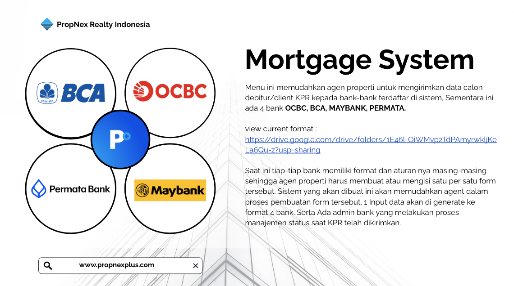

## Project Overview

The PropNex Multi-Bank Mortgage System is a strategic FinTech integration platform revolutionizing how PropNex Indonesia agents submit mortgage applications (KPR - Kredit Pemilikan Rumah) to Indonesia's leading financial institutions. Through exclusive partnerships with **OCBC NISP**, **Bank Central Asia (BCA)**, **Maybank Indonesia**, and **Bank Permata**, this Laravel-powered system eliminates the tedious process of filling out multiple bank-specific forms. Agents input client data once, and the system automatically generates compliant applications for all four banks simultaneously, while dedicated bank admin portals enable real-time application status tracking and management. This enterprise-grade platform demonstrates sophisticated multi-bank integration, document automation, and FinTech domain expertise.

## Business Context & Financial Integration Challenge

### Understanding KPR (Mortgage) in Indonesian Real Estate

**What is KPR?**

KPR (Kredit Pemilikan Rumah) is the Indonesian term for home mortgage loans. Real estate agents play a crucial role in helping property buyers secure financing by submitting mortgage applications to banks on behalf of clients. This is a critical service that directly impacts property transaction success rates.

**Traditional Multi-Bank Application Challenges**

Before this system, PropNex agents faced severe inefficiencies:

- **Multiple Form Formats** – Each bank (OCBC, BCA, Maybank, Permata) has unique application forms
- **Repetitive Data Entry** – Agents manually fill out 4 different forms with same client data
- **Hours of Duplicate Work** – Completing all forms can take 2-3 hours per client
- **Format Confusion** – Different field labels, validation rules, document requirements
- **Error-Prone Process** – Manual copying leads to inconsistencies and rejected applications
- **No Status Tracking** – Agents have no visibility into application progress with banks
- **Email-Based Submission** – Sending documents via email without confirmation tracking
- **Lost Applications** – No centralized record of which banks received which applications

**Business Impact of Inefficiency**

- **Reduced Agent Productivity** – Time spent on forms instead of closing deals
- **Client Dissatisfaction** – Slow mortgage approval process delays property purchases
- **Missed Opportunities** – Agents avoid submitting to multiple banks due to time constraints
- **Competitive Disadvantage** – Agencies with better mortgage processes win more deals
- **Revenue Loss** – Delayed or failed mortgage approvals mean lost commissions

### Project Objectives

Build an enterprise mortgage integration platform that:

- **Single Input, Multiple Outputs** – One data entry generates 4 bank-specific forms automatically
- **Bank Partnership Integration** – Formalize digital submission channels with OCBC, BCA, Maybank, Permata
- **Automated Document Generation** – Create compliant PDF/Excel forms matching each bank's format
- **Status Tracking Dashboard** – Real-time visibility into application status at each bank
- **Bank Admin Portal** – Enable bank officers to update application status and provide feedback
- **Agent Productivity Boost** – Reduce form completion time from 2-3 hours to 5-10 minutes
- **Centralized Application Database** – Complete audit trail of all mortgage submissions
- **Quality Assurance** – Validation rules prevent submission of incomplete or incorrect data

### Strategic Banking Partnerships

**OCBC NISP (Oversea-Chinese Banking Corporation)**

- Top 10 bank in Indonesia by assets
- Strong mortgage product portfolio with competitive rates
- Specific form format with comprehensive income verification requirements
- Digital-forward bank open to integration partnerships

**Bank Central Asia (BCA)**

- Largest private bank in Indonesia by market capitalization
- Industry-leading mortgage approval rates and processing speed
- Complex application format with detailed property valuation requirements
- Premium banking partner requiring stringent data quality standards

**Maybank Indonesia**

- Malaysian-owned bank with strong Indonesian presence
- Competitive mortgage rates for middle-income property buyers
- Streamlined application process with emphasis on employment verification
- Regional mortgage processing centers requiring standardized submissions

**Bank Permata**

- Mid-sized commercial bank with growing mortgage portfolio
- Flexible mortgage products for various property types
- Unique application format with additional lifestyle assessment fields
- Actively seeking real estate agency partnerships for loan pipeline

### Target User Stakeholders

**PropNex Property Agents**

- 500+ agents managing property transactions requiring mortgage financing
- Need efficient way to submit client KPR applications to multiple banks
- Require visibility into application status to update clients
- Want to maximize mortgage approval rates to close more deals

**Bank Mortgage Officers (Admin Portal Users)**

- 8-12 officers per bank handling PropNex mortgage applications
- Need centralized platform to receive and process applications
- Update application status (pending, approved, rejected, need documents)
- Provide feedback and request additional documentation from agents

**PropNex Management**

- Monitor mortgage application volume and approval rates by bank
- Track agent performance in securing financing for clients
- Analyze partnership effectiveness with each banking partner
- Demonstrate value to banking partners through data and analytics

## Technical Architecture & FinTech Stack

Enterprise-grade financial technology platform with document automation and multi-bank integration.

### Core Technology Stack

- **Backend Framework**: Laravel 10 with service-oriented architecture
- **Database**: MySQL with optimized schema for mortgage application data
- **Document Generation**: Laravel Excel + PDF libraries (DomPDF/SnappyPDF)
- **Template Engine**: Blade templates for dynamic form generation
- **File Storage**: AWS S3 for secure document storage with encryption
- **Authentication**: Multi-tenant authentication for agents and bank admins
- **Queue System**: Laravel Queue for asynchronous document generation
- **Email Service**: Laravel Mail for application notifications and status updates
- **Validation Engine**: Custom validation rules matching each bank's requirements
- **Form Mapping System**: JSON-based field mapping for bank-specific formats

### System Architecture

**Document Generation Pipeline**

- **Single Input Form** – Comprehensive data collection covering all bank requirements
- **Unified Data Model** – Standardized internal representation of client data
- **Bank-Specific Transformers** – Convert unified data to each bank's format
- **Template System** – Blade templates matching official bank form layouts
- **PDF/Excel Generation** – Export to formats required by each bank (PDF for OCBC/BCA, Excel for Maybank/Permata)
- **Quality Validation** – Pre-submission checks ensuring data completeness
- **Batch Generation** – Simultaneously generate all 4 bank forms with single action

**Multi-Bank Integration Architecture**

- **Bank-Specific Models** – Separate database tables for each bank's unique fields
- **Field Mapping Configuration** – JSON configuration files defining field transformations
- **Validation Rule Engine** – Bank-specific validation rules (e.g., BCA income calculations)
- **Template Management** – Version-controlled form templates for each bank
- **Format Converters** – Data formatters for dates, currency, phone numbers per bank standards

**Multi-Role Portal System**

- **Agent Portal** – PropNex agents submit and track applications
- **Bank Admin Portals** – Separate login/dashboard for each bank's mortgage officers
- **Super Admin Portal** – PropNex management analytics and system configuration
- **Role-Based Access Control** – Bank admins only see applications for their bank
- **Permission Management** – Granular permissions for different admin levels

**Status Management Workflow**

- **Application States** – Draft, Submitted, Under Review, Approved, Rejected, Need Documents
- **Status Tracking** – Each bank independently manages their application status
- **Notification System** – Real-time alerts to agents when bank updates status
- **Audit Trail** – Complete history of status changes and user actions
- **SLA Monitoring** – Track processing times and bank response rates

## Comprehensive Feature Set by User Role

Sophisticated mortgage management capabilities tailored to agents, bank officers, and administrators.

### Agent Portal Features

**Unified KPR Application Form**

- **Single Input Interface** – One comprehensive form capturing all client mortgage data
- **Client Information** – Personal details, contact, ID numbers (KTP/NPWP)
- **Employment Details** – Company name, position, income, length of employment
- **Property Information** – Property address, type, price, developer details
- **Financial Data** – Monthly income, expenses, existing loans, down payment
- **Document Upload** – KTP, NPWP, salary slips, bank statements, property docs
- **Auto-Save** – Automatic draft saving to prevent data loss
- **Field Validation** – Real-time validation matching all 4 banks' requirements

**Multi-Bank Form Generation**

- **One-Click Generation** – Generate all 4 bank forms simultaneously
- **OCBC Format** – PDF application matching OCBC NISP official form layout
- **BCA Format** – PDF application with BCA-specific field ordering and calculations
- **Maybank Format** – Excel spreadsheet matching Maybank Indonesia template
- **Permata Format** – Excel format with Bank Permata's unique assessment fields
- **Preview Before Submit** – Review generated forms before sending to banks
- **Bulk Download** – Download all 4 forms as single ZIP file

**Application Management Dashboard**

- **Application List** – View all submitted KPR applications with status
- **Multi-Status Tracking** – See separate status for each bank (e.g., BCA approved, OCBC pending)
- **Color-Coded Status** – Visual indicators for quick status recognition
- **Search & Filter** – Find applications by client name, date, bank, status
- **Application History** – Complete timeline of each application
- **Bank Feedback** – View comments and document requests from bank officers

**Status Notifications**

- **Real-Time Alerts** – Instant notifications when bank updates application status
- **Email Notifications** – Email alerts for status changes and new bank comments
- **Dashboard Badges** – Unread notification counters
- **Status Change Log** – Detailed history of all status updates with timestamps
- **Document Request Alerts** – Notifications when banks request additional documents

**Performance Analytics**

- **Approval Rate Tracking** – View approval rates by bank
- **Processing Time** – Average time to approval for each bank
- **Application Volume** – Number of submissions per month
- **Best-Performing Banks** – Identify which banks approve applications fastest
- **Personal Statistics** – Individual agent performance metrics

### Bank Admin Portal Features

**Application Queue Management**

- **Incoming Applications** – List of new KPR applications from PropNex agents
- **Bank-Specific View** – Each bank admin only sees applications for their bank
- **Application Details** – Full client information, employment, property details
- **Document Viewer** – View all uploaded supporting documents
- **Application Priority** – Mark urgent applications for faster processing
- **Batch Processing** – Handle multiple applications efficiently

**Status Update Management**

- **Status Change Interface** – Update application status with dropdown selections
- **Status Options** – Draft, Submitted, Under Review, Approved, Rejected, Need Documents, On Hold
- **Comment System** – Add notes and feedback visible to agents
- **Document Requests** – Request specific additional documents from agents
- **Approval Workflow** – Multi-step approval process with supervisor sign-off
- **Rejection Reasons** – Predefined rejection reasons with custom notes

**Communication Tools**

- **Agent Messaging** – Direct communication with PropNex agents
- **Internal Notes** – Private notes for bank internal use (not visible to agents)
- **Document Request Templates** – Pre-written messages for common document requests
- **Email Integration** – Send automated emails to agents for status updates
- **Notification Settings** – Configure notification preferences

**Bank Analytics Dashboard**

- **Application Volume** – Number of applications received from PropNex
- **Approval Metrics** – Approval, rejection, pending rates
- **Processing Times** – Average time from submission to decision
- **Agent Performance** – Which PropNex agents submit highest quality applications
- **Monthly Reports** – Automated monthly partnership performance reports
- **Trend Analysis** – Application volume and approval trends over time

### Super Admin Portal Features

**System Configuration**

- **Bank Settings** – Configure settings for each banking partner
- **Template Management** – Update form templates when banks change formats
- **Field Mapping Editor** – Modify JSON field mappings for each bank
- **Validation Rules** – Update validation rules per bank requirements
- **User Management** – Create and manage agent and bank admin accounts
- **Permission Configuration** – Set granular permissions for different roles

**Partnership Management**

- **Bank Partnership Dashboard** – Overview of all 4 banking partnerships
- **Partnership Metrics** – Performance comparison across all banks
- **SLA Monitoring** – Track bank response times against agreed SLAs
- **Partnership Health Score** – Automated scoring of partnership effectiveness
- **Escalation Management** – Handle issues and escalations from agents or banks

**Advanced Analytics**

- **Cross-Bank Comparison** – Compare approval rates, processing times across banks
- **Agent Performance Leaderboard** – Top-performing agents by approval rate
- **Regional Analysis** – Mortgage application patterns by geographic region
- **Property Type Analysis** – Approval rates by property type (house, apartment, land)
- **Income Bracket Analysis** – Success rates by client income levels
- **Custom Reports** – Build custom reports with flexible filters

**Audit & Compliance**

- **Activity Logs** – Complete audit trail of all system actions
- **Data Access Logs** – Track who accessed which client data and when
- **Compliance Reports** – Financial regulation compliance reporting
- **Data Export** – Export data for external audits or analysis
- **Version History** – Track changes to application data over time

## Bank-Specific Form Format Implementation

Deep dive into handling each bank's unique form requirements and specifications.

### OCBC NISP Form Generation

**Format Specifications**

- **Document Type**: PDF with fixed layout matching official OCBC KPR form
- **Page Count**: 4-page comprehensive application form
- **Layout**: Two-column design with labeled fields and checkboxes
- **Font Requirements**: Arial 10pt for content, 12pt bold for section headers
- **Income Verification**: Detailed breakdown of primary and secondary income sources
- **Property Valuation**: OCBC-specific property assessment fields

**Unique OCBC Fields**

- **Credit Card Limit Total** – Sum of all credit card limits (required field)
- **Other Bank Facilities** – Detailed listing of loans at other banks
- **Property Developer Reputation** – Assessment of developer track record
- **Neighborhood Infrastructure** – Proximity to schools, hospitals, transportation
- **OCBC Relationship** – Existing OCBC products (savings, credit cards)
- **Insurance Preference** – Property and life insurance selections

**Data Transformations**

- Income formatted as Rupiah with thousand separators
- Date format: DD/MM/YYYY (e.g., 17/01/2026)
- Phone numbers with +62 country code
- Property address with complete postal code
- Employment duration in years and months format

### Bank Central Asia (BCA) Form Generation

**Format Specifications**

- **Document Type**: PDF with BCA corporate branding and watermark
- **Page Count**: 6-page detailed application with supporting information
- **Layout**: Single-column design with extensive data fields
- **Font Requirements**: Calibri 11pt, BCA blue color (#003087) for headers
- **Income Calculation**: BCA's proprietary debt service ratio (DSR) calculation
- **Property Analysis**: Detailed market value and loan-to-value (LTV) assessment

**Unique BCA Fields**

- **BCA Customer ID** – Existing BCA customer number (if applicable)
- **Monthly Living Expenses Breakdown** – Categorized expense listing
- **Vehicle Ownership** – Details of owned vehicles with values
- **Investment Portfolio** – Stocks, mutual funds, other investments
- **Business Ownership** – If self-employed, detailed business information
- **Emergency Contact** – Two emergency contacts with relationships

**Data Transformations**

- Income calculations: Net income after tax with formula display
- DSR Calculation: (Total Debt / Gross Income) × 100 displayed
- Date format: DD-MMM-YYYY (e.g., 17-Jan-2026)
- Currency: IDR with "Rp" prefix and period separators (e.g., Rp 15.000.000)
- Checkbox formatting for Yes/No fields

### Maybank Indonesia Form Generation

**Format Specifications**

- **Document Type**: Microsoft Excel (.xlsx) with pre-defined template structure
- **Sheet Count**: 3 worksheets (Personal Info, Employment, Property & Financials)
- **Layout**: Spreadsheet format with color-coded sections (Maybank yellow theme)
- **Data Validation**: Excel dropdown lists for categorical fields
- **Formula Fields**: Auto-calculating fields for ratios and totals
- **Protection**: Locked template cells with editable data entry cells only

**Unique Maybank Fields**

- **Ethnicity/Race** – Required for Maybank's demographic analysis
- **Education Level** – Highest education attained (dropdown selection)
- **Marital Status Details** – If married, spouse employment and income
- **Number of Dependents** – Children and other dependents
- **Primary Bank Relationship** – Main bank for salary and transactions
- **Maybank Product Interest** – Cross-sell opportunities (credit card, insurance)

**Data Transformations**

- Excel date serial numbers for date fields
- Currency formatting with Indonesian Rupiah accounting format
- Dropdown validation lists for categorical data
- Formula cells: =SUM(), =IF() for conditional calculations
- Percentage formatting for ratio fields (LTV, DSR)
- Conditional formatting: Red for high-risk ratios, green for low-risk

### Bank Permata Form Generation

**Format Specifications**

- **Document Type**: Microsoft Excel (.xlsx) with Bank Permata corporate template
- **Sheet Count**: 4 worksheets (Applicant, Co-Applicant, Property, Financials)
- **Layout**: Detailed spreadsheet with merged cells and structured sections
- **Color Scheme**: Permata green (#00A651) for headers and key sections
- **Lifestyle Assessment**: Additional sheet for lifestyle and spending patterns
- **Supporting Docs Checklist**: Integrated document requirement checklist

**Unique Permata Fields**

- **Lifestyle Score** – Bank Permata's proprietary lifestyle assessment
- **Social Media Presence** – LinkedIn, Facebook profiles (optional for verification)
- **Hobbies & Interests** – Personal interests for customer profiling
- **Travel Frequency** – Annual travel patterns and destinations
- **Charity & Community** – Involvement in community or charitable activities
- **Professional Network** – Industry associations and professional memberships

**Data Transformations**

- Multi-sheet data distribution with cell references
- Named ranges for important data points
- Excel tables with structured references
- Drop-down lists with data validation rules
- Currency: Rupiah with Indonesian locale formatting
- Text fields: Title case for names, uppercase for ID numbers

### Technical Implementation of Form Generation

**Template Management System**

- **Version Control** – Git-tracked templates with change history
- **Template Variables** – Blade-style variables {{ $client_name }} in templates
- **Conditional Sections** – Show/hide sections based on data (e.g., co-applicant)
- **Dynamic Tables** – Generate variable-length tables for loans, assets
- **Calculation Engine** – Server-side calculation of derived fields

**PDF Generation Process**

1. **Data Collection** – Retrieve client data from unified database model
2. **Bank-Specific Transform** – Apply bank's field mapping and calculations
3. **Template Rendering** – Populate Blade template with transformed data
4. **HTML to PDF** – Convert rendered HTML to PDF with DomPDF/SnappyPDF
5. **Quality Check** – Validate PDF against bank specifications
6. **File Storage** – Save PDF to S3 with encrypted storage
7. **Download Link** – Generate secure temporary download URL

**Excel Generation Process**

1. **Template Loading** – Load bank's official .xlsx template file
2. **Data Mapping** – Map unified data to specific Excel cells
3. **Cell Population** – Write data to designated cells using PhpSpreadsheet
4. **Formula Preservation** – Maintain template formulas and calculations
5. **Styling Maintenance** – Preserve bank's formatting and branding
6. **Validation Rules** – Apply dropdown lists and data validation
7. **File Export** – Export populated workbook as .xlsx
8. **File Storage** – Save to S3 and generate download link

**Quality Assurance Checks**

- **Required Field Validation** – Ensure all mandatory fields populated
- **Format Compliance** – Verify data formats match bank requirements
- **Calculation Accuracy** – Verify DSR, LTV, and other calculations
- **Template Integrity** – Check no template corruption during population
- **File Size Limits** – Ensure generated files within bank size restrictions
- **Branding Verification** – Confirm bank logos and branding intact

## Professional Skills Demonstrated

Comprehensive technical and business capabilities showcased through this FinTech integration project.

### Technical Competencies

**Document Automation & Generation**

- PDF generation with pixel-perfect layout matching official bank forms
- Excel workbook manipulation with PhpSpreadsheet library
- Template-based document creation with variable substitution
- Dynamic table generation for variable-length data
- Preservation of complex formatting, formulas, and branding
- Batch document generation with queue-based processing

**FinTech & Banking Domain Expertise**

- Understanding mortgage application requirements and banking workflows
- Implementation of financial calculations (DSR, LTV, affordability ratios)
- Knowledge of Indonesian banking regulations and KPR standards
- Data security and privacy compliance for financial information
- Multi-bank integration with varying requirements and specifications
- Financial document management and audit trail requirements

**Full-Stack Enterprise Development**

- Laravel 10 enterprise application architecture
- MySQL database design for complex financial data relationships
- Multi-tenant authentication system (agents, bank admins per bank)
- Role-based access control with granular permissions
- Queue-based asynchronous processing for document generation
- AWS S3 integration for secure encrypted file storage

**Data Transformation & Mapping**

- Complex field mapping between unified model and bank-specific formats
- JSON-based configuration for flexible field mapping rules
- Custom validation rules matching each bank's specific requirements
- Data formatting and conversion (dates, currency, phone numbers)
- Calculation engines for derived fields and financial ratios
- Template variable substitution and conditional rendering

**System Integration & Partnerships**

- Multi-bank integration architecture supporting 4 distinct partners
- Standardized interfaces with bank-specific implementations
- Version-controlled form templates for maintainability
- SLA monitoring and partnership performance tracking
- Scalable architecture to accommodate future banking partners
- Status synchronization and notification systems

### Banking Partnership Management

**Financial Institution Collaboration**

- Building relationships with OCBC, BCA, Maybank, Permata mortgage teams
- Understanding each bank's unique requirements and workflows
- Negotiating digital submission processes and system access
- Coordinating template updates when banks change form formats
- Establishing communication channels for issue resolution
- Demonstrating system reliability and data quality to bank partners

**Compliance & Security**

- Financial data protection and encryption (PCI-DSS considerations)
- Indonesian financial regulation compliance (OJK regulations)
- Secure document storage with access controls and audit logs
- Privacy compliance for client personal and financial information
- Data retention policies aligned with banking requirements
- Incident response planning for data security issues

**Stakeholder Management**

- PropNex agent training and onboarding for system usage
- Bank admin onboarding and portal access provisioning
- Managing expectations across multiple banking partners
- Gathering feedback from agents and iterating on UX
- Coordinating with PropNex management for strategic decisions
- Balancing competing requirements from different banks

### PropTech & Real Estate Domain Knowledge

**Mortgage Workflow Understanding**

- Real estate agent role in mortgage application process
- Client documentation requirements for KPR applications
- Property valuation and appraisal integration points
- Timeline and urgency of mortgage approvals for closing deals
- Common reasons for mortgage rejection and mitigation strategies
- Cross-selling opportunities between real estate and banking

**Indonesian Property Market**

- KPR product landscape across major Indonesian banks
- Competitive mortgage rates and approval criteria
- Property types and their financing implications (primary, secondary)
- Regional variations in property markets and bank preferences
- Developer relationships and bank partnerships for new properties
- Government subsidy programs and eligibility requirements

### Software Engineering Excellence

**Scalable Architecture**

- Service-oriented architecture separating concerns
- Queue-based processing preventing timeouts during bulk generation
- Caching strategies for template loading and frequent queries
- Database indexing and query optimization for performance
- Horizontal scalability for growing agent and application volume

**Code Quality & Maintainability**

- Clean code principles with single responsibility classes
- Comprehensive validation preventing invalid data submission
- Error handling and graceful degradation
- Extensive logging for debugging and audit requirements
- Version control and deployment best practices
- Automated testing for critical form generation logic

**Production Operations**

- AWS S3 file storage with lifecycle policies and cost optimization
- Database backup and disaster recovery procedures
- Monitoring and alerting for system health and errors
- Performance optimization for document generation pipelines
- Security updates and dependency management
- User support and bug tracking workflows

## Why This Project Matters for HR Evaluation

### Demonstrates Enterprise FinTech Integration Capabilities

This project proves expertise in:

- **Financial System Development** – Building production-grade mortgage processing platform
- **Multi-Bank Integration** – Successfully connecting with 4 major Indonesian banks simultaneously
- **Document Automation** – Sophisticated PDF/Excel generation matching official bank formats
- **Complex Business Logic** – Implementing bank-specific calculations, validations, and workflows
- **Real Business Impact** – Reducing agent processing time from 2-3 hours to 5-10 minutes (95%+ efficiency gain)

### Shows Banking Partnership & Collaboration Skills

The project highlights ability to:

- **Build Financial Partnerships** – Establish working relationships with OCBC, BCA, Maybank, Permata
- **Navigate Banking Requirements** – Understand and implement each bank's unique form specifications
- **Professional Communication** – Coordinate with multiple banking partners simultaneously
- **Compliance Understanding** – Handle financial data with appropriate security and privacy measures
- **Long-Term Relationship Management** – Maintain system as banks update forms and requirements

### Highlights FinTech & PropTech Industry Experience

Working in financial and real estate technology demonstrates:

- **Domain Expertise** – Deep understanding of mortgage workflows and agent needs
- **Financial Calculations** – Implementing DSR, LTV, and other banking formulas correctly
- **Market Knowledge** – Familiarity with Indonesian banking and property markets
- **Regulatory Awareness** – Understanding KPR regulations and compliance requirements
- **Business Impact Focus** – Features directly improving agent productivity and client satisfaction

### Proves Technical Leadership & Problem-Solving

The project showcases:

- **Complex Problem Solving** – Transforming tedious manual process into automated workflow
- **Strategic Architecture** – Unified data model generating 4 different bank formats
- **Template Management** – Version-controlled, maintainable form template system
- **Scalability Planning** – Architecture designed to add more banking partners easily
- **Innovation** – Novel approach to multi-bank mortgage submission in Indonesian market

### Demonstrates Production-Ready Financial System Development

Quality indicators include:

- **Data Security** – Encrypted storage of sensitive financial and personal information
- **Audit Trail** – Complete logging of all applications and status changes
- **Multi-Role Access** – Sophisticated RBAC with bank-specific data visibility
- **Document Quality** – Pixel-perfect generation matching official bank forms
- **Error Handling** – Comprehensive validation preventing incomplete submissions
- **Performance Optimization** – Queue-based processing for bulk document generation

> **For HR Professionals**: This enterprise FinTech project demonstrates a developer who can handle complex financial system integration while managing real banking partnerships with major Indonesian financial institutions (OCBC, BCA, Maybank, Permata). The sophisticated document automation system that reduces agent workload by 95% showcases strong problem-solving skills, technical depth in PDF/Excel generation, and understanding of banking workflows. This is strategic technical work that delivers measurable business value - transforming an inefficient manual process into a streamlined automated system that directly impacts PropNex's competitive advantage and agent productivity. The ability to work with multiple banking partners simultaneously demonstrates professional maturity and stakeholder management skills essential for enterprise software development.

## Key Takeaways

### Core Competencies Demonstrated

- **FinTech Integration** – Multi-bank mortgage application system with 4 major Indonesian banks
- **Document Automation** – Sophisticated PDF and Excel generation matching official bank forms
- **Enterprise Architecture** – Scalable Laravel platform with queue-based processing
- **Banking Partnerships** – Professional collaboration with OCBC, BCA, Maybank, Permata
- **Financial Domain Expertise** – KPR workflows, banking calculations, regulatory compliance
- **Massive Productivity Gain** – 95% reduction in form completion time (2-3 hours to 5-10 minutes)

### Technical Skills Showcased

- **Backend**: Laravel 10, Queue System, Multi-tenant Auth, MySQL, Complex Business Logic
- **Document Generation**: DomPDF, PhpSpreadsheet, Template Systems, Dynamic PDF/Excel creation
- **Banking Integration**: Multi-bank data mapping, Format transformation, Calculation engines
- **Data Security**: AWS S3 encrypted storage, Audit logging, Financial data protection
- **Form Automation**: JSON field mapping, Validation engines, Template version control

### Professional Attributes

- **Banking Partnership Management** – Building and maintaining relationships with major banks
- **Strategic Problem Solving** – Transforming inefficient manual process into automated system
- **FinTech Domain Expertise** – Understanding mortgage workflows and banking requirements
- **Production Quality** – Security, compliance, audit trail for financial system
- **Business Impact** – Directly improving agent productivity and client satisfaction

## Conclusion: Enterprise FinTech Integration Excellence

The PropNex Multi-Bank Mortgage System represents sophisticated financial technology integration at its finest – combining complex document automation, multi-bank partnership management, strategic problem-solving, and deep understanding of banking and real estate workflows. This ongoing project demonstrates the ability to build production-grade financial systems that deliver massive productivity gains while managing relationships with major financial institutions.

Working directly with Indonesia's leading banks (OCBC, BCA, Maybank, Permata) to automate mortgage application submission showcases not only advanced technical capabilities in document generation and data transformation but also professional partnership management skills essential for FinTech development. The system's impact – reducing form completion time from 2-3 hours to 5-10 minutes – demonstrates the ability to deliver high-value business-critical solutions that directly improve organizational efficiency and competitive positioning.

The project's handling of sensitive financial data, multi-bank compliance requirements, sophisticated document generation matching official bank formats, and scalable architecture supporting future banking partnerships reflects enterprise-level software engineering practices applicable across financial services and technology industries.

**Key Takeaway**: Leading enterprise FinTech integration project connecting PropNex Indonesia with 4 major Indonesian banks (OCBC, BCA, Maybank, Permata) through sophisticated mortgage application automation system. Built with Laravel, the platform transforms single client data input into multiple bank-specific PDF/Excel forms, achieving 95% efficiency gain (reducing 2-3 hours to 5-10 minutes). Implementing complex document automation, multi-tenant bank admin portals, financial calculation engines, and comprehensive status tracking. Demonstrating expertise in FinTech development, banking partnership management, document generation technology, and financial domain knowledge – delivering measurable business impact through strategic technical innovation in Indonesian PropTech market.
