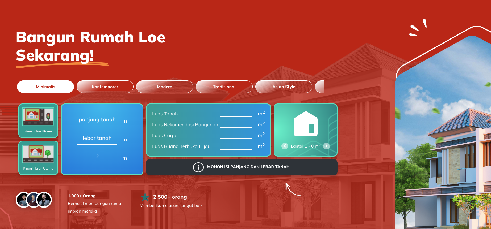

## Project Overview

**rumahgue.com** is PropNex Indonesia's strategic initiative to capture and nurture the next generation of property buyers by creating a modern, youth-oriented digital platform that combines financial education, property knowledge, and relatable content. Unlike traditional real estate platforms targeting established buyers, rumahgue.com aims to engage millennials and Gen-Z prospects from their early career stages, building financial literacy and property awareness years before they're ready to purchase. This forward-thinking approach positions PropNex to build long-term relationships with future buyers while differentiating the brand as trendy, reliable, and genuinely helpful in Indonesia's competitive real estate market.

**Current Status**: Pre-development phase - awaiting C-level approval and KPI/budget definition

## Strategic Business Context & Market Opportunity

### The Youth Property Market Gap in Indonesia

**Underserved Market Segment**

The Indonesian property market has traditionally focused on established buyers (35+ years old) with stable income and savings, leaving younger generations (22-34 years old) largely unaddressed. This demographic represents Indonesia's future property demand but lacks targeted resources for financial and property education.

**Current Market Challenges for Young Buyers**

- **Financial Illiteracy** – Limited understanding of mortgages, down payments, and affordability
- **Property Knowledge Gap** – Unclear about property types, locations, and investment value
- **Intimidating Industry** – Traditional real estate feels formal, complex, and unapproachable
- **Information Overload** – Conflicting advice from multiple sources without reliable guidance
- **No Early Engagement** – Real estate agencies only engage prospects when they're ready to buy
- **Missed Education Window** – No systematic financial education during early career years

**PropNex's Strategic Insight**

PropNex Indonesia recognizes that capturing young buyers early – before they're ready to purchase – creates:

- **Long-Term Relationship Building** – Trust and brand loyalty developed over years
- **First-Mover Advantage** – Position PropNex as the go-to resource for young property seekers
- **Larger Buying Pool** – Nurture prospects who will enter the market in 2-5 years
- **Competitive Differentiation** – Stand out from competitors focused only on immediate buyers
- **Brand Modernization** – Transform PropNex from corporate to relatable and youth-friendly

### Project Vision & Objectives

**Core Mission**

Create Indonesia's most trusted, trendy ("gaul"), and reliable property education platform specifically designed for millennial and Gen-Z audiences, positioning PropNex as a helpful partner in their property journey from awareness to purchase.

**Strategic Goals**

- **Financial Education** – Teach young Indonesians about saving, budgeting, and mortgage readiness
- **Property Knowledge** – Demystify property buying process, types, locations, and investment strategies
- **Early Engagement** – Capture prospects 2-5 years before they're financially ready to buy
- **Brand Positioning** – Establish PropNex as modern, relatable, and genuinely helpful to youth
- **Lead Pipeline** – Build database of future buyers for long-term conversion
- **Content Marketing** – Create shareable, valuable content that builds organic reach

**Target Audience**

**Primary: Young Professionals (25-32 years old)**

- Early to mid-career professionals with growing income
- Renting apartments or living with parents
- Interested in property but unsure how to start
- Active on social media and digital platforms
- Value authenticity, education, and relatability

**Secondary: Fresh Graduates (22-25 years old)**

- Just entering workforce with first salaries
- Long-term property aspirations but no immediate plans
- Seeking financial literacy and career growth guidance
- Highly engaged with trendy, youth-oriented content
- Future buyers in 5-7 years

### Why "rumahgue.com"?

**Brand Name Strategy**

- **"Rumah"** – Indonesian word for "house" (clear property focus)
- **"Gue"** – Jakarta slang for "my" (youth-oriented, relatable, conversational)
- **Combined Meaning** – "My House" in trendy, informal language resonating with young Indonesians
- **Domain Strategy** – Memorable, easy to spell, Indonesia-focused (.com for credibility)

**Brand Personality**

- **Gaul (Trendy)** – Modern design, slang language, social media-savvy content
- **Reliable** – Backed by PropNex credibility with accurate, helpful information
- **Approachable** – Friendly tone removing intimidation from property topics
- **Educational** – Value-first content helping users make informed decisions
- **Empowering** – "You can do this" message building confidence in young buyers

## Professional Project Lifecycle at PropNex Indonesia

### Demonstrating Enterprise-Level Project Management Process

This section showcases the comprehensive, structured approach I follow when initiating and executing major projects at PropNex Indonesia – demonstrating professional project management skills essential for enterprise software development.

### Phase 1: Strategic Ideation & Market Analysis

**Identifying Business Opportunity**

- **Market Research** – Analyzing Indonesian youth demographics and property market trends
- **Competitive Analysis** – Studying existing property platforms and identifying gaps
- **Stakeholder Interviews** – Gathering insights from PropNex agents about young client challenges
- **Trend Analysis** – Identifying shift toward younger first-time buyers in Indonesian market
- **Problem Definition** – Articulating clear business problem and opportunity statement

**Initial Concept Development**

- **Value Proposition** – Defining unique value for target audience (financial + property education)
- **Differentiation Strategy** – How rumahgue.com differs from traditional property portals
- **Brand Positioning** – "Gaul" (trendy) yet reliable approach for youth engagement
- **Content Strategy** – Educational content as primary value driver
- **Revenue Model** – Long-term lead generation and conversion strategy

**Preliminary Technical Assessment**

- **Platform Requirements** – Content management, user engagement, educational resources
- **Technology Stack Evaluation** – Laravel for backend, modern frontend frameworks
- **Scalability Considerations** – Supporting growing user base and content library
- **Integration Needs** – Potential integration with existing PropNex systems
- **Development Timeline Estimation** – Initial rough timeline and resource requirements

### Phase 2: C-Level Stakeholder Engagement

**Preparing Executive Presentation**

- **Business Case Documentation** – Comprehensive justification with market data and projections
- **Competitive Landscape** – Visual comparison with competitors and differentiation points
- **Target Market Analysis** – Demographic data, market size, and growth potential
- **Strategic Alignment** – How project supports PropNex's overall business strategy
- **Risk Assessment** – Identifying potential challenges and mitigation strategies

**C-Level Meeting Objectives**

- **Gain Strategic Approval** – Secure leadership buy-in for youth market expansion
- **Define Success Metrics** – Establish clear KPIs aligned with business objectives
- **Budget Allocation** – Determine investment level for development and marketing
- **Resource Assignment** – Identify team members and external resources needed
- **Timeline Approval** – Get agreement on project milestones and launch timeline

**Key Performance Indicators (KPIs) Under Discussion**

_Awaiting C-level meeting to finalize specific metrics, preliminary KPIs include:_

- **User Acquisition** – Target number of registered users in first 6-12 months
- **Engagement Metrics** – Monthly active users, time on site, content consumption
- **Content Performance** – Article views, shares, bookmark rates for educational content
- **Lead Generation** – Number of qualified leads captured for future property sales
- **Conversion Funnel** – Progression from visitor → registered user → engaged prospect → buyer
- **Brand Awareness** – Social media reach, mentions, sentiment among target demographic
- **ROI Timeline** – Expected timeframe for lead-to-sale conversion (2-5 years)

**Budget Planning Considerations**

_Pending C-level approval, budget will cover:_

- **Development Costs** – Platform development, CMS implementation, integration work
- **Design & UX** – Youth-oriented design system, branding, illustrations
- **Content Creation** – Financial literacy articles, property guides, video content
- **Marketing & Launch** – Social media campaigns, influencer partnerships, PR
- **Infrastructure** – Hosting, CDN, analytics tools, monitoring systems
- **Ongoing Operations** – Content maintenance, community management, updates

### Phase 3: Requirements Gathering & Planning (Next Step)

**Post-Approval Activities**

Once C-level approval and KPIs are established, the project will enter detailed planning:

- **Detailed Requirements Documentation** – Comprehensive functional and technical specifications
- **User Stories & Use Cases** – Specific scenarios for target audience interactions
- **Content Strategy Development** – Editorial calendar, content types, publishing schedule
- **Technical Architecture Design** – System design, database schema, API structure
- **UI/UX Design Process** – Wireframes, mockups, prototypes, user testing
- **Project Timeline & Milestones** – Detailed development sprint planning
- **Resource Allocation** – Team assignments, role definitions, capacity planning

### Phase 4: Design & Prototyping (Future)

**Visual Design Development**

- Modern, youth-appealing color palette and typography
- Trendy illustrations and graphics resonating with millennials/Gen-Z
- Mobile-first responsive design for smartphone-heavy audience
- Intuitive navigation emphasizing content discovery
- Social sharing optimizations for viral content potential

**Content Management System Design**

- Easy-to-use CMS for non-technical content creators
- Article templates for consistent educational content
- Category/tagging system for content organization
- SEO optimization features for organic reach
- Analytics integration for content performance tracking

### Phase 5: Development & Implementation (Future)

**Technical Development**

- Laravel-based backend with robust CMS capabilities
- Modern frontend framework (Vue.js/React) for interactive features
- RESTful API for potential mobile app expansion
- Content delivery optimization for fast page loads
- User authentication and profile management

**Content Production**

- Financial education articles (saving, budgeting, mortgage basics)
- Property knowledge guides (types, locations, investment strategies)
- Video tutorials and infographics for visual learners
- Interactive calculators (affordability, mortgage payments, savings goals)
- Success stories from young property owners

### Phase 6: Testing & Launch Preparation (Future)

**Quality Assurance**

- User acceptance testing with target demographic
- Content review for accuracy and tone appropriateness
- Performance testing for scalability
- SEO audit and optimization
- Security assessment and compliance checks

**Marketing & Launch Strategy**

- Social media presence establishment (Instagram, TikTok, LinkedIn)
- Influencer partnerships with financial education creators
- PR campaign targeting youth-focused media outlets
- Launch event or campaign creating buzz
- Agent training on platform usage and lead nurturing

### Phase 7: Launch & Iteration (Future)

**Initial Launch**

- Soft launch with limited audience for feedback
- Monitoring analytics and user behavior
- Gathering user feedback and testimonials
- Identifying pain points and improvement opportunities
- Iterating on content and features based on data

**Ongoing Optimization**

- A/B testing for content and design elements
- Regular content updates and new educational resources
- Community building and user engagement initiatives
- Analytics review and strategy adjustments
- Continuous improvement based on KPIs

## Why This Project Lifecycle Matters for HR Evaluation

### Demonstrates Strategic Thinking & Business Acumen

**Beyond Technical Execution**

This project showcases that I don't just code – I think strategically about:

- **Market Opportunities** – Identifying underserved segments and business potential
- **Competitive Positioning** – Understanding how to differentiate in crowded markets
- **Long-Term Value** – Building assets that generate returns over years, not just immediate projects
- **Brand Strategy** – Developing brand positioning that resonates with target audiences
- **ROI Thinking** – Balancing investment with projected returns and business impact

### Shows C-Level Engagement & Professional Maturity

**Executive Stakeholder Management**

- **Preparing Executive Presentations** – Distilling complex ideas into clear business cases
- **Speaking the Language of Leadership** – Discussing KPIs, budgets, ROI, strategic alignment
- **Managing Up** – Proactively engaging leadership rather than waiting for directives
- **Strategic Alignment** – Connecting technical projects to broader business objectives
- **Professional Credibility** – Trusted with major initiatives requiring C-level approval

### Proves Comprehensive Project Management Skills

**Structured Approach to Major Initiatives**

- **Phase-Gate Process** – Following proper planning stages before execution
- **Risk Management** – Identifying risks early and planning mitigation strategies
- **Resource Planning** – Thinking about budgets, timelines, team composition
- **KPI Definition** – Establishing measurable success criteria before starting work
- **Stakeholder Coordination** – Managing multiple stakeholders with different interests

### Highlights Responsible Development Approach

**Not Rushing to Code**

- **Research First** – Understanding market, users, and competition before building
- **Approval Gates** – Seeking proper authorization before consuming resources
- **Budget Consciousness** – Considering financial implications and ROI
- **Success Metrics** – Defining how success will be measured before starting
- **Strategic Patience** – Waiting for proper planning rather than hasty execution

### Shows Marketing & Product Thinking

**Beyond Backend Development**

- **Product Strategy** – Thinking about product-market fit and value proposition
- **Go-to-Market** – Considering launch strategy and user acquisition
- **Content Strategy** – Understanding role of content in platform success
- **Brand Development** – Creating brand identity that resonates with target audience
- **User Psychology** – Understanding what motivates and engages target demographic

> **For HR Professionals**: The rumahgue.com project demonstrates a developer who operates at strategic level, not just tactical execution. This isn't about writing code – it's about identifying business opportunities, developing comprehensive project plans, engaging C-level executives with business cases, defining success metrics, and following professional project management processes. The structured approach from ideation through C-level approval before development begins shows maturity, business acumen, and ability to work at enterprise level where projects require strategic justification and proper resource allocation. This is someone who can be trusted with major initiatives that require executive approval and have long-term business implications.

## Planned Technical Architecture (Post-Approval)

Modern content-focused platform designed for youth engagement and educational value delivery.

### Proposed Technology Stack

- **Backend Framework**: Laravel 10 with content management focus
- **Database**: MySQL for content storage, user data, and analytics
- **Frontend**: Vue.js or React for interactive, dynamic user experience
- **CMS**: Headless CMS or custom Laravel-based content system
- **Content Delivery**: CDN for fast global content delivery
- **Analytics**: Google Analytics 4, custom engagement tracking
- **Authentication**: Social login (Google, Facebook) for easy registration
- **Email Marketing**: Integration with email service for newsletters
- **SEO Tools**: Built-in SEO optimization for organic traffic
- **Media Management**: Image optimization, video embedding, infographics

### Platform Architecture Vision

**Content-First Platform**

- **Educational Content Library** – Extensive financial and property knowledge base
- **Interactive Tools** – Calculators, quizzes, assessment tools
- **User Profiles** – Save articles, track progress, personalized recommendations
- **Community Features** – Comments, discussions, Q&A sections
- **Mobile-Optimized** – Primary focus on mobile experience for young users

**Key Platform Features (Planned)**

**Financial Education Hub**

- **Budgeting Guides** – How to save for down payment, manage expenses
- **Mortgage Basics** – Understanding KPR, interest rates, loan terms
- **Affordability Calculators** – Interactive tools to estimate buying power
- **Savings Strategies** – Investment options, emergency funds, financial planning
- **Credit Score Education** – Building credit history for mortgage approval

**Property Knowledge Center**

- **Property Types Explained** – Apartments vs houses, primary vs secondary
- **Location Guides** – Neighborhood profiles, commute analysis, lifestyle fit
- **Investment Strategies** – Buy to live vs buy to rent, appreciation potential
- **Legal Process** – Step-by-step property buying process in Indonesia
- **Developer Reviews** – Trusted developers and project assessments

**User Engagement Features**

- **Personalized Dashboard** – User's learning progress and saved resources
- **Recommendation Engine** – Suggest content based on user interests and stage
- **Progress Tracking** – Financial readiness score, property knowledge level
- **Milestone Celebrations** – Gamification of financial goals achievement
- **Success Stories** – Real stories from young property buyers

**Lead Nurturing System**

- **User Segmentation** – Stage-based categorization (early-stage, ready soon, ready now)
- **Email Campaigns** – Automated educational series based on user stage
- **PropNex Agent Connection** – Seamless handoff when user is ready to buy
- **CRM Integration** – Feed qualified leads into PropNex main CRM system
- **Long-Term Tracking** – Monitor user journey from education to purchase

## Anticipated Professional Skills Development

### Skills This Project Will Further Demonstrate

**Product Management**

- Full product lifecycle from concept to launch
- Market research and competitive analysis
- Product-market fit validation and iteration
- Feature prioritization based on user needs
- Go-to-market strategy development

**Content Strategy & Marketing**

- Content marketing for B2C audience
- SEO optimization for organic growth
- Social media strategy and execution
- Community building and engagement
- Brand voice development for specific demographic

**User Experience Design**

- Youth-oriented UI/UX design principles
- Mobile-first design and responsive layouts
- Content discovery and navigation optimization
- Engagement optimization and gamification
- Accessibility for diverse users

**Full-Stack Development**

- Content management system architecture
- User authentication and profile management
- Interactive web applications (calculators, tools)
- Performance optimization for content-heavy sites
- Analytics integration and tracking implementation

**Data Analytics**

- User behavior analysis and insights
- Content performance metrics and optimization
- Conversion funnel analysis
- A/B testing and experimentation
- Predictive analytics for lead scoring

**Strategic Business Development**

- C-level stakeholder management
- ROI modeling and business case development
- KPI definition and success measurement
- Budget planning and resource allocation
- Cross-functional team coordination

## Key Takeaways

### Core Competencies Demonstrated

- **Strategic Thinking** – Identifying market opportunities and developing comprehensive business cases
- **C-Level Engagement** – Preparing executive presentations and managing stakeholder approval processes
- **Project Lifecycle Management** – Following structured phase-gate approach from ideation to execution
- **Business Acumen** – Understanding market dynamics, competitive positioning, and ROI modeling
- **Product Strategy** – Developing complete product vision including market fit and go-to-market plans
- **Professional Maturity** – Exercising strategic patience and proper planning before execution

### Professional Attributes Showcased

- **Proactive Leadership** – Identifying opportunities and driving strategic initiatives
- **Stakeholder Management** – Engaging C-level executives with compelling business cases
- **Budget Consciousness** – Planning resource allocation and ROI before starting projects
- **Risk Management** – Identifying potential challenges and mitigation strategies upfront
- **KPI-Driven Approach** – Defining success metrics aligned with business objectives
- **Long-Term Thinking** – Building assets that generate value over years, not just immediate projects

### Business & Market Understanding

- **Target Market Segmentation** – Understanding demographics, psychographics, and buyer personas
- **Competitive Analysis** – Studying market landscape and identifying differentiation opportunities
- **Brand Development** – Creating brand identity and positioning for specific audiences
- **Content Strategy** – Understanding role of education and value-first approach in marketing
- **Lead Generation Strategy** – Long-term nurturing and conversion funnel development

## Conclusion: Strategic Project Leadership & Professional Process

The rumahgue.com initiative demonstrates comprehensive strategic thinking and professional project management processes essential for enterprise-level software development. Rather than rushing to code, this project showcases a mature, structured approach: identifying market opportunities through research, developing comprehensive business cases, engaging C-level stakeholders for approval, defining success metrics, planning budgets, and only then proceeding to technical execution.

This is how major initiatives work in professional enterprise environments – strategic justification precedes resource allocation, executive approval gates ensure alignment with business objectives, and proper KPIs measure success. The ability to operate at this strategic level, prepare executive presentations, discuss ROI and business impact, and follow formal project management processes demonstrates readiness for senior technical leadership roles where projects require business justification and strategic alignment.

**Current Status**: Awaiting C-level meeting to finalize KPIs and budget allocation. Project will proceed to detailed planning and design phase upon approval, followed by development, testing, and launch. Updates will be provided as project progresses through approved milestones.

**Key Takeaway**: Leading strategic initiative to expand PropNex's market reach to younger Indonesian property buyers through rumahgue.com – a trendy, reliable educational platform. Currently in pre-development phase demonstrating complete project lifecycle management from market research and business case development through C-level stakeholder engagement for KPI definition and budget approval. Showcasing strategic thinking, business acumen, executive communication skills, and professional project management processes essential for enterprise-level technical leadership. Project represents multi-year investment in brand building and lead generation targeting 2-5 year conversion timeline, demonstrating understanding of long-term strategic value creation beyond immediate technical execution.
