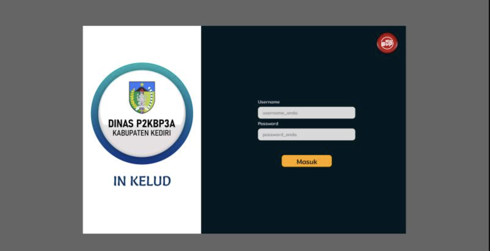

## Project Overview

Inkelud for Kediri Government is a comprehensive government dashboard website developed to streamline municipal data management for Kediri City administration. This project was executed under contract with Navasa Studio, delivering a full-stack solution that includes API development, frontend implementation, and deployment to secure government servers.

## Development Journey & Contract Details

This government project required adherence to strict security protocols and government standards while delivering a robust data management platform.

### Contract & Employment Structure

Hired by Navasa Studio as the primary developer for this government contract, handling end-to-end development and deployment responsibilities.

##### Project Engagement Details

- **Contracting Company**: Navasa Studio
- **Client**: Kediri City Government
- **Role**: Full-Stack Developer
- **Contract Duration**: Development + 3 months maintenance
- **Deployment Access**: Government VPN credentials provided

### Technical Architecture & Government Requirements

Developed a secure, scalable dashboard system meeting government data management standards and zero-downtime requirements.

##### Core Technical Implementation

- **Backend API Development** – Created comprehensive RESTful APIs for city data management
- **Frontend Dashboard** – Built responsive administrative interface for government officials
- **Government Server Deployment** – Deployed directly to secure government infrastructure
- **Data Management System** – Implemented robust data handling preventing RTO issues

### Infrastructure & Security Management

Managed deployment and maintenance on government servers with strict security protocols.

##### Government Server Deployment

- **VPN Access Management** – Secured VPN connection for government server access
- **Server Configuration** – Optimized government server environment for application deployment
- **Security Compliance** – Adhered to government security standards and protocols
- **Performance Optimization** – Configured system for smooth browsing without data interruptions

### Data Management & RTO Prevention

Developed comprehensive data management strategies ensuring continuous data availability.

##### Advanced Data Management Features

- **Zero RTO Architecture** – Implemented systems preventing Recovery Time Objective issues
- **City Data Integration** – Comprehensive management of all municipal data streams
- **Smooth Browsing Optimization** – Ensured seamless user experience for government officials
- **Data Redundancy Systems** – Built failover mechanisms for continuous data availability

##### Municipal Data Management

- **Multi-Department Integration** – Centralized data management across city departments
- **Real-time Data Processing** – Live data updates and synchronization
- **Administrative Workflows** – Streamlined government administrative processes
- **Reporting & Analytics** – Comprehensive reporting tools for city administration

### API Development & Integration

Created robust API infrastructure supporting comprehensive government data operations.

##### API Architecture Implementation

- **RESTful API Design** – Standards-compliant API structure for government data
- **Authentication & Authorization** – Secure access control for government officials
- **Data Validation** – Comprehensive input validation and sanitization
- **Performance Optimization** – Efficient API responses for smooth dashboard operations

### Frontend Dashboard Development

Built user-friendly administrative interface tailored for government officials.

##### Dashboard Features

- **Responsive Design** – Optimized for various devices used by government staff
- **Intuitive Navigation** – User-friendly interface for non-technical government officials
- **Real-time Updates** – Live data visualization and monitoring capabilities
- **Administrative Controls** – Comprehensive management tools for city data operations

### Maintenance & Support Services

Provided comprehensive maintenance services ensuring continuous system reliability.

##### 3-Month Maintenance Program

- **Regular System Monitoring** – Continuous performance and security monitoring
- **Bug Fixes & Updates** – Immediate resolution of any system issues
- **Performance Optimization** – Ongoing system tuning for optimal performance
- **Government Support** – Direct support for government officials using the system

## Technical Stack & Government Standards

The project utilizes technologies approved for government use:

- **Backend**: PHP with custom framework, RESTful APIs
- **Database**: MySQL with government-grade security configurations
- **Frontend**: JavaScript, responsive web technologies
- **Infrastructure**: Government servers with VPN access
- **Security**: Government-compliant authentication and encryption
- **Deployment**: Direct government server deployment

## Project Impact & Government Results

The Inkelud platform has significantly improved Kediri Government operations:

- **Eliminated RTO Issues** – Achieved zero recovery time objectives for critical city data
- **Streamlined Data Management** – Centralized all municipal data operations
- **Improved Administrative Efficiency** – Enhanced government workflow processes
- **Smooth User Experience** – Ensured seamless browsing for all government users

## Government Compliance & Security

Maintained strict adherence to government standards throughout development:

##### Security Implementation

- **Government Security Protocols** – Full compliance with municipal security requirements
- **VPN-Based Access** – Secure connection protocols for system access
- **Data Protection** – Government-grade data encryption and protection measures
- **Audit Trail Systems** – Comprehensive logging for government accountability

## Long-term System Reliability

Designed for sustained government operations with minimal maintenance requirements:

- **Robust Architecture** – Built to handle continuous government operations
- **Scalable Design** – Accommodates growing municipal data requirements
- **Reliable Performance** – Consistent system performance under government workloads
- **Future-Proof Technology** – Modern tech stack supporting long-term government use

> This project demonstrates expertise in government-contract development, delivering secure, reliable solutions that meet strict governmental requirements while ensuring zero downtime and smooth data operations for municipal administration.

The platform continues to serve Kediri Government's data management needs, showcasing the ability to deliver enterprise-grade solutions under government contracts with professional maintenance and support services.
