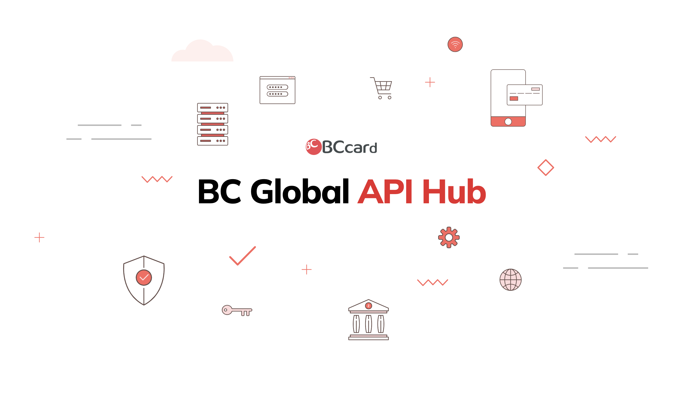

## Project Overview

Gapih.com is a professional landing page website developed for Korea's leading payment platform API Hub. This static single-page website serves as the primary introduction to their payment gateway solution, showcasing their position as the No.1 Payment Platform in Korea that connects millions of users nationwide.

## Platform Introduction & Market Position

Gapih.com represents Korea's premier payment infrastructure, operating as a national payment switcher with extensive market coverage.

### Market Leadership Statistics

- **36 Million Users** – Extensive user base across Korea
- **40 Financial Institutions** – Comprehensive banking network integration
- **3.2 Million Merchants** – Wide merchant ecosystem coverage
- **National Switcher** – Primary payment infrastructure for Korea

## Technical Implementation

Built as a lightweight, static website optimized for performance and user engagement.

### Development Architecture

- **Framework**: CodeIgniter 3 for robust backend structure
- **Website Type**: Static single-page application
- **Hosting**: AWS cloud infrastructure for reliable performance
- **Purpose**: Product introduction and brand presentation

### AWS Cloud Hosting

Deployed on Amazon Web Services for scalable, reliable hosting:

- **High Availability** – AWS infrastructure ensuring consistent uptime
- **Global Performance** – Optimized content delivery for Korean market
- **Scalable Resources** – AWS services supporting traffic variations
- **Security** – AWS security features protecting the landing page

## Landing Page Features

Designed to effectively introduce and promote the payment gateway platform.

### Content Strategy

- **Product Introduction** – Clear presentation of API Hub payment solutions
- **Market Position** – Highlighting leadership in Korean payment industry
- **Statistics Showcase** – Prominent display of user and merchant numbers
- **Professional Design** – Corporate-grade visual presentation

### User Experience Design

- **Single Page Layout** – Streamlined information presentation
- **Responsive Design** – Optimized for various devices and screen sizes
- **Fast Loading** – Static content for optimal performance
- **Clear Messaging** – Focused communication of platform benefits

## Payment Gateway API Hub

The landing page introduces Gapih's comprehensive payment infrastructure solution.

### Platform Capabilities

- **National Payment Switching** – Central hub for Korean payment processing
- **Multi-Institution Integration** – Seamless connection across 40 financial institutions
- **Merchant Network** – Extensive support for 3.2M merchants nationwide
- **User Base Management** – Infrastructure supporting 36M active users

### API Integration Services

- **Payment Gateway APIs** – Comprehensive payment processing solutions
- **Financial Institution Connectivity** – Direct integration with major Korean banks
- **Merchant Services** – Complete payment solutions for businesses
- **Real-time Processing** – Instant transaction processing capabilities

## Technical Stack & Infrastructure

Modern web technologies deployed on enterprise-grade cloud infrastructure:

- **Backend**: CodeIgniter 3 framework
- **Frontend**: Responsive HTML/CSS/JavaScript
- **Hosting**: Amazon Web Services (AWS)
- **Architecture**: Static single-page application
- **Performance**: Optimized for fast loading and user engagement

## Project Impact & Business Results

The landing page effectively communicates Gapih's market leadership and platform capabilities:

- **Brand Positioning** – Establishes Gapih as Korea's leading payment platform
- **Market Credibility** – Showcases impressive user and merchant statistics
- **Professional Presence** – Provides authoritative introduction to payment services
- **Business Development** – Supports client acquisition and partnership development

## AWS Cloud Benefits

Leveraging AWS infrastructure for optimal performance:

- **Reliability** – Enterprise-grade hosting for consistent availability
- **Scalability** – Cloud resources adapting to traffic demands
- **Security** – AWS security features protecting business-critical content
- **Performance** – Global content delivery optimized for Korean market

> This project demonstrates expertise in creating professional landing pages for fintech companies, combining effective content strategy with robust technical implementation to showcase market-leading payment platform solutions.

The Gapih.com landing page successfully introduces Korea's premier payment gateway platform, highlighting their dominant market position while providing a professional digital presence for business development and client engagement.
