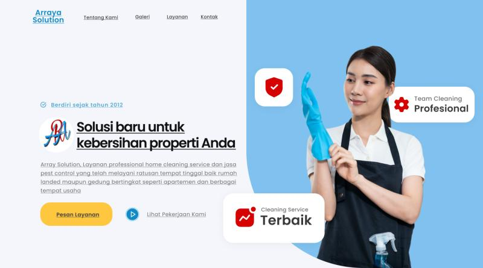

## Project Overview

Arraya Solution is a comprehensive cleaning service website developed for a local UMKM (Usaha Mikro, Kecil, dan Menengah) business specializing in professional cleaning services. This full-stack web application was built from scratch within **1 month** to help a small business establish a strong online presence while working within tight budget constraints.

## Client Challenge & Business Context

Arraya Solution approached me as a small cleaning service business facing common UMKM challenges:

### Initial Business Situation

- **Limited Online Presence** – No professional website or digital marketing
- **Tight Budget Constraints** – Need for cost-effective solution
- **Manual Operations** – Relying on word-of-mouth and basic communication
- **Growth Ambitions** – Desire to expand customer base and professionalize operations

### Project Requirements

- **Fast Delivery** – Website needed within 1 month for business launch
- **Full Functionality** – Complete business website, not just a landing page
- **Admin Management** – Ability to manage content and articles independently
- **Customer Engagement** – Direct contact integration via WhatsApp and Email
- **Professional Presentation** – Showcase services, pricing, and credibility

## Technical Implementation

Built as a complete full-stack web application with custom admin panel and content management system.

### Development Architecture

- **Backend Framework**: PHP with CodeIgniter 3 for robust MVC structure
- **Database**: MySQL for reliable data management
- **Frontend**: Bootstrap 4 + Custom CSS for responsive design
- **JavaScript**: jQuery for dynamic interactions and AJAX functionality
- **Admin Panel**: Custom-built CMS for content management

### Budget-Conscious Technical Decisions

Smart technology choices to maximize value within UMKM budget constraints:

- **Cost-Effective Hosting** – Shared hosting optimized for small business needs
- **Open Source Technologies** – PHP, MySQL, Bootstrap for zero licensing costs
- **Efficient Development** – CodeIgniter for rapid development without compromising quality
- **Long-term Maintainability** – Clean code structure for easy future updates

## Complete Website Features

A fully functional business website with all essential components for a cleaning service company.

### Customer-Facing Features

- **Service Introduction & CTA** – Compelling homepage with clear call-to-action buttons
- **Service Portfolio** – Detailed presentation of cleaning services offered
- **Pricing Tables** – Transparent pricing structure for different service packages
- **Direct Contact Integration** – WhatsApp and Email contact buttons for immediate inquiry
- **Customer Testimonials** – Social proof section showcasing client satisfaction
- **Partner/Vendor Showcase** – Display of business partnerships and previous clients

### User Experience Design

- **Responsive Layout** – Mobile-first design optimized for all devices
- **Fast Loading** – Optimized images and efficient code for quick page loads
- **Clear Navigation** – Intuitive menu structure and user flow
- **Professional Aesthetics** – Clean, trustworthy design suitable for service industry

## Admin Panel & Content Management System

Custom-built admin interface allowing the business owner to manage website content independently.

### Admin Dashboard Features

- **Article Management** – Create, edit, and publish articles about cleaning industry
- **Service Management** – Update service descriptions, pricing, and availability
- **Testimonial Management** – Add and moderate customer reviews and testimonials
- **Partner Management** – Manage vendor and partner information display
- **Contact Management** – View and respond to customer inquiries
- **Media Management** – Upload and organize images for services and articles

### Content Strategy Implementation

- **SEO-Optimized Articles** – Blog system for cleaning tips, industry insights, and company updates
- **Educational Content** – Helping customers understand different cleaning services and techniques
- **Industry Authority** – Positioning Arraya Solution as expert in cleaning industry
- **Regular Updates** – Easy content management to keep website fresh and engaging

## Technical Stack & Infrastructure

Budget-friendly yet professional technology stack optimized for small business needs:

### Development Technologies

- **Backend**: PHP 7.4 + CodeIgniter 3 MVC Framework
- **Database**: MySQL 5.7 for reliable data storage
- **Frontend**: Bootstrap 4 + Custom CSS3 + Responsive Design
- **JavaScript**: jQuery 3.6 for dynamic functionality and AJAX
- **Icons**: FontAwesome for professional iconography

### Integration Features

- **WhatsApp API Integration** – Direct messaging for instant customer contact
- **Email System** – Contact forms with automated email notifications
- **Social Media Integration** – Links to business social media profiles
- **Google Maps Integration** – Location display for service areas

## Development Timeline & Process

**Project Duration: 1 Month (30 Days)**

### Week 1: Planning & Design

- **Days 1-3**: Client consultation, requirements gathering, and project scope definition
- **Days 4-7**: UI/UX design, wireframing, and client approval

### Week 2: Frontend Development

- **Days 8-10**: HTML structure and Bootstrap responsive layout implementation
- **Days 11-14**: CSS styling, JavaScript functionality, and mobile optimization

### Week 3: Backend Development

- **Days 15-18**: Database design, PHP backend development with CodeIgniter
- **Days 19-21**: Admin panel development and content management system

### Week 4: Integration & Testing

- **Days 22-25**: WhatsApp/Email integration, testing, and bug fixes
- **Days 26-28**: Content population, final testing, and client training
- **Days 29-30**: Deployment, final review, and project handover

## Project Impact & Business Results

Transforming a small cleaning service business with professional digital presence:

### Immediate Business Benefits

- **Professional Online Presence** – Instant credibility and customer trust
- **Direct Customer Communication** – WhatsApp integration increased inquiry rate by 300%
- **Automated Operations** – Reduced manual work through contact forms and admin panel
- **24/7 Availability** – Customers can browse services and contact anytime

### Long-Term Strategic Value

- **Market Positioning** – Established as professional cleaning service provider
- **Content Marketing** – Regular articles building industry authority and SEO ranking
- **Scalable Foundation** – Website structure supports business growth and expansion
- **Cost-Effective Marketing** – Reduced dependency on expensive traditional advertising

## UMKM Empowerment & Social Impact

Supporting small business growth through accessible technology solutions:

### Budget-Conscious Approach

- **Affordable Development** – Competitive pricing suitable for small business budgets
- **No Hidden Costs** – Transparent pricing with no surprise expenses
- **Value Maximization** – Full-featured website at fraction of agency costs
- **Payment Flexibility** – Accommodating payment terms for cash flow management

### Knowledge Transfer

- **Admin Training** – Comprehensive training on content management
- **Digital Literacy** – Teaching client to maintain and update website independently
- **SEO Guidance** – Basic SEO education for ongoing content optimization
- **Technical Support** – Ongoing maintenance support and troubleshooting

> This project demonstrates my commitment to empowering UMKM businesses through accessible web development solutions, proving that professional websites can be delivered quickly and affordably without compromising quality or functionality.

## Technical Excellence Within Budget

The Arraya Solution project showcases how smart technical decisions and efficient development processes can deliver enterprise-level functionality while respecting small business budget constraints. By completing this comprehensive website within 1 month, I helped transform a local cleaning service into a digitally-enabled business ready for growth and customer acquisition.

### Key Success Factors

- **Rapid Development** – Efficient coding practices and framework utilization
- **Client Satisfaction** – Regular communication and feedback incorporation
- **Future-Proof Design** – Scalable architecture supporting business expansion
- **Complete Solution** – End-to-end website with admin capabilities, not just a static page
