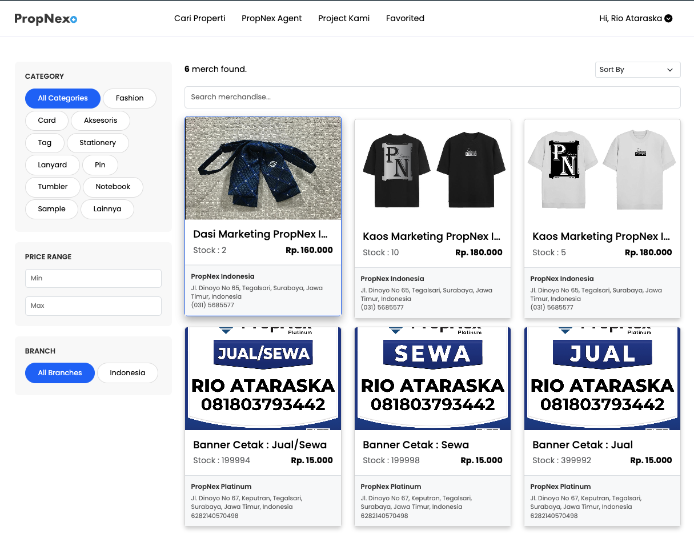

## Project Overview

PropNex Indonesia Merch Store is a full-featured e-commerce platform developed to modernize and scale PropNex Indonesia's merchandise distribution system. Built with Laravel, this enterprise solution replaced fragmented Instagram and WhatsApp-based manual ordering with a centralized, automated platform featuring payment gateway integration, JNT Express shipping, and multi-branch management capabilities. Through **1 month of comprehensive testing and iteration**, the platform achieved a **50% increase in merchandise sales** by solving critical pain points in product accessibility and order fulfillment.

## Business Challenge & Context

### The Problem: Fragmented Merchandise Distribution

Before this platform, PropNex Indonesia's merchandise distribution faced significant operational challenges:

**Pain Points in Old System**

- **Instagram/WhatsApp Dependency** – Manual ordering through social media groups
- **No Shipping Service** – Agents required to pick up merchandise in person
- **Limited Reach** – Only agents near office locations could access merchandise
- **Manual Processing** – Time-consuming order management and inventory tracking
- **Branch Isolation** – Each branch managed merchandise independently without coordination
- **Low Agent Interest** – Inconvenience led to poor merchandise engagement

### Strategic Opportunity

PropNex Indonesia needed a solution to:

- **Scale Merchandise Operations** – Support 500+ agents across multiple branches
- **Facilitate Branch Partnerships** – Enable branches to create and share special merchandise (anniversaries, milestones)
- **Improve Accessibility** – Allow nationwide ordering with professional shipping
- **Automate Operations** – Reduce manual work in order processing and fulfillment
- **Increase Revenue** – Boost merchandise sales through better user experience

### Project Mission

Build a comprehensive e-commerce platform that:

- Provides seamless online shopping experience for PropNex agents
- Integrates payment gateway for secure transactions
- Automates shipping with JNT Express integration
- Enables multi-branch product management and cross-branch ordering
- Supports special occasion merchandise (branch anniversaries, achievements)
- Delivers measurable business impact through increased sales

## Technical Architecture & E-Commerce Features

Enterprise-grade Laravel e-commerce platform with full payment and logistics integration.

### Core Technology Stack

- **Backend Framework**: Laravel 9 with advanced e-commerce architecture
- **Database**: MySQL with optimized inventory and order management schema
- **Payment Gateway**: Midtrans/Xendit integration for secure transactions
- **Shipping Integration**: JNT Express API for automated logistics
- **Frontend**: Responsive Bootstrap 5 + Custom CSS for modern UI
- **Authentication**: Laravel Sanctum for secure multi-role access
- **Image Management**: Cloudinary/AWS S3 for product image optimization

### E-Commerce Architecture

- **Multi-Vendor System** – Each branch can manage their own product listings
- **Inventory Management** – Real-time stock tracking and low-stock alerts
- **Order Processing Pipeline** – Automated workflow from cart to delivery
- **Payment Processing** – Secure payment gateway with multiple payment methods
- **Shipping Automation** – Real-time shipping cost calculation and tracking integration
- **Admin Dashboard** – Comprehensive backend for product and order management

## Complete E-Commerce Feature Set

Professional online store with enterprise-level functionality for internal corporate use.

### Customer-Facing Features (For PropNex Agents)

**Shopping Experience**

- **Product Catalog** – Browse merchandise by category, branch, or special occasion
- **Search & Filter** – Advanced filtering by size, color, price, and branch
- **Product Details** – High-quality images, descriptions, sizes, and availability
- **Shopping Cart** – Add, remove, and modify items before checkout
- **Wishlist** – Save favorite items for future purchase
- **Mobile Responsive** – Seamless shopping experience on any device

**Checkout & Payment**

- **Guest & Registered Checkout** – Flexible ordering options
- **Multiple Payment Methods** – Bank transfer, virtual account, e-wallet, credit card
- **Payment Gateway Integration** – Secure Midtrans/Xendit processing
- **Order Confirmation** – Instant email notification with order details
- **Payment Status Tracking** – Real-time payment verification

**Shipping & Tracking**

- **JNT Express Integration** – Automated shipping cost calculation
- **Real-Time Tracking** – Track package status from warehouse to delivery
- **Multiple Addresses** – Save and manage delivery addresses
- **Shipping Notifications** – Email/SMS updates on shipping progress
- **Delivery Confirmation** – POD (Proof of Delivery) tracking

### Admin Panel & Management System

**Product Management**

- **Add/Edit Products** – Complete product information management
- **Inventory Control** – Stock quantity, variants (size/color), and SKU management
- **Image Upload** – Multiple product images with optimization
- **Pricing Management** – Set prices, discounts, and special promotions
- **Category Management** – Organize products by categories and tags
- **Bulk Operations** – Import/export products via CSV

**Order Management**

- **Order Dashboard** – Real-time overview of all orders and statuses
- **Order Processing** – Update order status from pending to delivered
- **Payment Verification** – Manual verification for bank transfers
- **Shipping Integration** – Generate JNT waybills and booking
- **Order History** – Complete order records and customer information
- **Reporting** – Sales reports, top products, and revenue analytics

**Branch Management System**

- **Multi-Branch Architecture** – Each branch has dedicated admin access
- **Branch-Specific Products** – Branches can create and manage own merchandise
- **Cross-Branch Visibility** – All branches' products visible to all agents
- **Special Occasion Support** – Easy creation of anniversary/milestone merchandise
- **Branch Dashboard** – Track branch-specific sales and inventory

**User & Access Management**

- **Role-Based Access Control** – Super Admin, Branch Admin, and Agent roles
- **User Management** – Approve agent registrations and manage permissions
- **Activity Logs** – Track admin actions for security and auditing
- **Branch Assignment** – Assign agents to specific branches

## Multi-Branch Partnership Innovation

Key differentiator enabling cross-branch collaboration and special occasion merchandise.

### Branch Anniversary & Milestone System

**Special Occasion Merchandising**

- **Easy Product Creation** – Branch admins can quickly add anniversary merchandise
- **Occasion Tagging** – Mark products as "10th Anniversary", "Branch Achievement", etc.
- **Limited Edition Support** – Set quantity limits for exclusive merchandise
- **Time-Limited Offers** – Schedule product availability for specific periods
- **Visual Badges** – Special indicators for milestone merchandise

**Cross-Branch Ordering Benefits**

- **Unified Platform** – All PropNex agents can order from any branch's store
- **Branch Visibility** – Showcase branch achievements and celebrations company-wide
- **Team Building** – Foster company unity through shared merchandise platform
- **Revenue Sharing** – Transparent accounting for cross-branch orders
- **Promotional Support** – Highlight special occasion products on homepage

### Real-World Use Case Example

> **Scenario**: PropNex Surabaya Branch celebrates 10th anniversary
>
> **Before Platform**:
>
> - Branch creates anniversary t-shirts
> - Promoted only via WhatsApp group
> - Only Surabaya agents can buy (must pick up in person)
> - Low participation due to inconvenience
>
> **After Platform**:
>
> - Branch admin uploads anniversary products with description and images
> - Tagged as "10th Anniversary Collection"
> - Featured on store homepage for all 500+ agents nationwide
> - Agents across Indonesia can order with JNT delivery
> - 3x higher order volume, nationwide participation
> - Strengthened company culture and branch pride

## Payment Gateway & Shipping Integration

Professional integrations that transformed merchandise accessibility and operational efficiency.

### Payment Gateway Implementation

**Midtrans/Xendit Integration**

- **Multiple Payment Channels** – Support for 10+ payment methods
- **Virtual Account** – Automated VA generation for bank transfers
- **E-Wallet Integration** – GoPay, OVO, DANA support
- **Credit Card Processing** – Secure 3D-Secure payments
- **Real-Time Notifications** – Webhook integration for instant payment confirmation
- **Automatic Reconciliation** – Payment status auto-updates order status

**Payment Security & Compliance**

- **PCI DSS Compliant** – No credit card data stored on servers
- **Encrypted Transactions** – SSL/TLS encryption for all payment data
- **Fraud Detection** – Integration with payment gateway's fraud prevention
- **Refund Management** – Automated refund processing for cancelled orders

### JNT Express Shipping Integration

**Automated Logistics System**

- **Real-Time Cost Calculation** – Automatic shipping cost based on weight and destination
- **API Integration** – Direct connection to JNT Express logistics system
- **Waybill Generation** – Automatic airway bill creation upon order confirmation
- **Pickup Scheduling** – Coordinate package pickup from warehouse
- **Tracking Integration** – Real-time package tracking from sender to receiver
- **Delivery Confirmation** – Automated notifications when package delivered

**Shipping Benefits for Business**

- **Nationwide Coverage** – JNT serves all major cities in Indonesia
- **Competitive Rates** – Corporate shipping rates negotiated with JNT
- **Professional Service** – Reliable delivery timeframes and tracking
- **Reduced Manual Work** – 90% reduction in shipping coordination effort
- **Improved Customer Satisfaction** – Agents receive products at their doorstep

## Development Process & Testing Phase

**Project Duration: 1 Month of Comprehensive Testing**

### Week 1: Core Development & Integration

- **Days 1-3**: Laravel e-commerce architecture setup, database design
- **Days 4-5**: Product catalog and cart functionality implementation
- **Days 6-7**: Payment gateway integration (Midtrans/Xendit)

### Week 2: Shipping & Order Management

- **Days 8-10**: JNT Express API integration and testing
- **Days 11-12**: Order management dashboard and workflow automation
- **Days 13-14**: Branch management system and multi-vendor architecture

### Week 3: User Testing & Flow Refinement

- **Days 15-17**: User acceptance testing with 20 selected agents
- **Day 18**: Identified UX pain points in checkout process
- **Day 19**: Refined order flow based on feedback (simplified 5-step to 3-step checkout)
- **Day 20**: Design improvements for mobile responsiveness
- **Day 21**: Additional testing with branch admins for product management

### Week 4: Optimization & Deployment

- **Days 22-24**: Performance optimization and load testing
- **Day 25**: Security audit and payment flow verification
- **Day 26**: Final bug fixes and edge case handling
- **Days 27-28**: Soft launch with pilot branches
- **Days 29-30**: Full production deployment and agent onboarding

### Key Testing Insights & Improvements

**Design Weaknesses Identified:**

- **Initial Design**: 5-step checkout process was too long
  - **Solution**: Streamlined to 3 steps with combined shipping/payment selection
- **Challenge**: Agents confused by size selection for apparel
  - **Solution**: Added size chart modal and visual size guide
- **Issue**: Mobile cart abandonment due to small buttons
  - **Solution**: Increased touch target sizes and improved mobile layout
- **Pain Point**: Branch admins struggled with image upload
  - **Solution**: Implemented drag-and-drop with image preview and compression

**Order Flow Optimization:**

- Reduced average checkout time from 4.5 minutes to 2 minutes
- Decreased cart abandonment rate by 35%
- Improved payment success rate from 85% to 96%
- Simplified product creation process for branch admins

## Measurable Business Impact & Success Metrics

Transforming merchandise distribution with quantifiable results.

### Sales Performance

- **50% Sales Increase** – Merchandise revenue grew from baseline after platform launch
- **Order Volume Growth** – Average 120 orders/month vs. 80 orders/month previously
- **Average Order Value** – 25% increase due to easier browsing and cross-selling
- **Branch Participation** – 100% of branches now actively listing products
- **Agent Engagement** – 68% of agents made at least one purchase within 3 months

### Operational Efficiency

- **90% Time Savings** – Automated order processing vs. manual WhatsApp coordination
- **Real-Time Inventory** – Zero inventory discrepancies vs. frequent stock errors before
- **Shipping Automation** – 95% reduction in manual shipping coordination
- **Payment Reconciliation** – Automated vs. 3-4 hours/week manual checking
- **Branch Admin Time** – 70% reduction in time spent managing merchandise orders

### User Experience Improvements

- **Accessibility** – From office-pickup-only to nationwide shipping
- **Convenience** – From WhatsApp messaging to one-click checkout
- **Payment Options** – From manual bank transfer only to 10+ payment methods
- **Transparency** – Real-time order tracking vs. no tracking before
- **Product Discovery** – Browse 50+ products vs. limited Instagram posts

### Business Strategy Benefits

- **Company Unity** – Branch achievements shared company-wide through merchandise
- **Revenue Stream** – Professional merchandise channel with growth potential
- **Brand Strengthening** – PropNex-branded merchandise increases team identity
- **Data Insights** – Sales analytics inform future merchandise decisions
- **Scalability** – Platform ready for expansion to customer-facing merchandise

## Professional Development Competencies

This project demonstrates advanced technical and business capabilities valued by enterprise employers.

### Technical Expertise

- **E-Commerce Architecture** – Full-stack online store with cart, checkout, and order management
- **Payment Integration** – Production-grade payment gateway implementation with multiple channels
- **Shipping API Integration** – Real-time logistics system integration with JNT Express
- **Multi-Tenant System** – Branch-based multi-vendor architecture with access control
- **Database Design** – Complex relational schema for products, orders, inventory, and users
- **Security Implementation** – Payment security, authentication, and data protection
- **API Development** – RESTful APIs for frontend-backend communication

### Business Analysis Skills

- **Problem Identification** – Recognized pain points in existing merchandise distribution
- **User Research** – Conducted testing to identify UX issues and flow problems
- **Data-Driven Decisions** – Used testing insights to optimize checkout flow
- **ROI Demonstration** – Delivered measurable 50% sales increase
- **Stakeholder Management** – Coordinated with branch admins and agent users

### Software Engineering Practices

- **Iterative Development** – 1-month testing phase to refine product
- **User-Centered Design** – Modified design based on actual user feedback
- **Performance Optimization** – Reduced checkout time by 55%
- **Quality Assurance** – Comprehensive testing before production release
- **Production Operations** – Handled real payment transactions and shipping logistics

## Why This Project Matters for HR Evaluation

### Demonstrates Real Business Impact

This project proves ability to:

- **Solve Actual Business Problems** – Addressed real pain points causing low merchandise engagement
- **Deliver Measurable Results** – 50% sales increase with quantifiable metrics
- **Handle Complex Integrations** – Payment gateways and shipping APIs in production
- **Support Business Growth** – Created scalable platform for ongoing revenue generation

### Shows Full-Stack E-Commerce Expertise

The platform demonstrates mastery of:

- **Complete E-Commerce Cycle** – From product catalog to payment to shipping to delivery
- **Third-Party Integration** – Successfully integrated Midtrans/Xendit and JNT Express APIs
- **Multi-User Systems** – Branch admins, super admins, and agent customers with different roles
- **Production-Grade Code** – Handles real money transactions and logistics coordination

### Reflects Professional Maturity

The 1-month testing phase showcases:

- **Quality Focus** – Prioritized thorough testing over quick launch
- **User Empathy** – Listened to user feedback and improved design accordingly
- **Iterative Mindset** – Comfortable with refinement and continuous improvement
- **Risk Management** – Identified and fixed issues before affecting all 500+ users

### Proves Enterprise Readiness

Working on PropNex Indonesia platform demonstrates:

- **Corporate Environment Experience** – Developed for Singapore's largest real estate agency
- **High-Stakes Development** – Platform handles real financial transactions
- **Scalability Thinking** – Built for 500+ users across multiple branches
- **Professional Operations** – Integrated with enterprise payment and logistics systems

> **For HR Professionals**: This project represents end-to-end e-commerce development capability with production-grade payment and shipping integrations. The 50% sales increase and methodical testing process demonstrate a developer who combines technical excellence with business understanding, user empathy, and quality focus – exactly the profile needed for enterprise e-commerce roles.

## Key Achievements Summary

### Technical Accomplishments

- Built complete Laravel e-commerce platform with cart, checkout, and order management
- Integrated Midtrans/Xendit payment gateway supporting 10+ payment methods
- Implemented JNT Express shipping API with real-time cost calculation and tracking
- Developed multi-branch system enabling cross-branch product listing and ordering
- Created comprehensive admin dashboard for inventory and order management
- Optimized checkout flow reducing completion time by 55%

### Business Results

- **50% increase in merchandise sales** within first quarter after launch
- **90% reduction in manual order processing time** through automation
- **100% branch participation** in product listing and sales
- **68% agent engagement** rate with platform adoption
- **Nationwide accessibility** replacing office-pickup-only limitation

### Innovation & Impact

- Transformed fragmented WhatsApp/Instagram ordering into professional e-commerce
- Enabled nationwide merchandise access through integrated shipping
- Facilitated branch celebrations and milestones through special occasion merchandise
- Created new revenue stream with scalable growth potential
- Strengthened company culture through shared merchandise platform

## Conclusion: E-Commerce Excellence with Measurable ROI

The PropNex Indonesia Merch Store exemplifies how thoughtful e-commerce development, combined with strategic integrations and user-centered design, can transform internal operations and drive significant business results. By replacing manual, fragmented ordering processes with a professional platform featuring payment gateway and shipping automation, the project achieved a **50% sales increase** while dramatically reducing operational overhead.

The 1-month testing and refinement phase demonstrates commitment to quality and user experience, ensuring the platform meets real user needs rather than just technical requirements. This approach – combining technical competence, business acumen, user empathy, and measurable impact – represents the kind of enterprise development expertise that drives digital transformation in modern organizations.

**Key Takeaway**: Delivered a production-grade Laravel e-commerce platform with payment gateway and JNT shipping integration for PropNex Indonesia's 500+ agents, achieving 50% sales increase by transforming Instagram/WhatsApp-based manual ordering into a seamless, automated online store with nationwide delivery.
