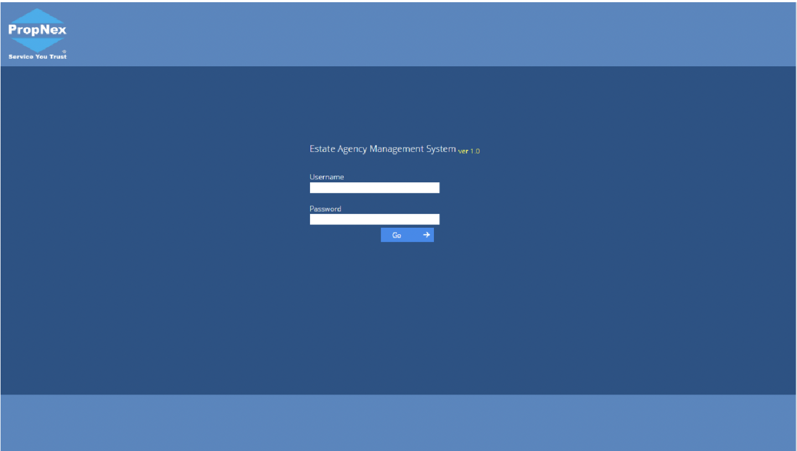

## System Overview

EAMS (Estate Agency Management System) is PropNex Indonesia's mission-critical enterprise platform that serves as the operational backbone for the entire real estate agency business. As the core system managing daily operations for 500+ agents across multiple branches nationwide, EAMS handles everything from agent onboarding and property listings to transaction processing, commission calculations, and business intelligence reporting. My role involves continuous maintenance, feature development, bug fixing, and system optimization to ensure business continuity and support PropNex Indonesia's growth as a subsidiary of Singapore's largest listed real estate agency.

## Business Context & System Importance

### PropNex Indonesia's Operational Backbone

EAMS is not just a software application – it is the central nervous system of PropNex Indonesia's business operations:

**Critical Business Functions**

- **Agent Lifecycle Management** – From recruitment to retirement, tracking 500+ active agents
- **Property Portfolio Management** – Managing thousands of property listings across Indonesia
- **Transaction Processing** – Recording and processing real estate deals and contracts
- **Commission Calculations** – Automated commission splits, calculations, and payouts
- **Branch Operations** – Multi-branch management with regional hierarchies
- **Business Intelligence** – Real-time dashboards and analytics for management decisions

**System Criticality**

- **Zero Downtime Requirement** – Business operations depend on 24/7 system availability
- **Financial Accuracy** – Handles millions of rupiah in commission calculations monthly
- **Regulatory Compliance** – Maintains records for legal and regulatory requirements
- **Scalability Needs** – Must support business growth and expanding agent network

### My Role: System Maintainer & Developer

As the technical steward of EAMS, my responsibilities encompass:

- **Ongoing Maintenance** – Daily monitoring, bug fixes, and system health checks
- **Feature Development** – Building new functionalities based on business requirements
- **Performance Optimization** – Ensuring fast response times and efficient database operations
- **Integration Management** – Connecting EAMS with other PropNex systems and third-party services
- **Emergency Response** – Rapid troubleshooting and resolution of critical issues
- **System Evolution** – Continuous improvements to support changing business needs

## Comprehensive System Architecture

Enterprise-grade Laravel application with complex business logic and multiple integrations.

### Core Technology Stack

- **Backend Framework**: Laravel 8/9 with advanced enterprise patterns
- **Database**: MySQL with optimized schema for high-volume transactions
- **Frontend**: Vue.js + Bootstrap for responsive admin interfaces
- **Authentication**: Multi-level access control with role-based permissions
- **Queue Management**: Laravel Queue for background job processing
- **Caching**: Redis for session management and performance optimization
- **File Storage**: AWS S3 for document and image management
- **Email Service**: SendGrid/AWS SES for transactional emails
- **Reporting**: Laravel Excel for complex data exports and reports

### Enterprise Architecture Components

- **Multi-Tenant Structure** – Branch-specific data isolation with centralized management
- **Role-Based Access Control** – Hierarchical permissions for different user types
- **Audit Trail System** – Complete logging of all critical operations
- **Background Job Processing** – Asynchronous handling of heavy operations
- **API Layer** – RESTful APIs for mobile app and external integrations
- **Notification System** – Multi-channel notifications (email, SMS, in-app)

## Core System Modules & Features

Comprehensive functionality covering all aspects of real estate agency operations.

### Agent Management Module

**Agent Lifecycle Management**

- **Agent Registration & Onboarding** – Digital onboarding process with document upload
- **Profile Management** – Complete agent profiles with certifications and qualifications
- **Team Structure** – Team leader hierarchies and agent groupings
- **Performance Tracking** – Sales targets, achievements, and performance metrics
- **Contract Management** – Agent contracts, renewals, and terminations
- **Training Records** – Track training completion and certification status

**Agent Portal Features**

- **Personal Dashboard** – Performance overview, commissions, and activities
- **Property Management** – Add, edit, and manage property listings
- **Lead Management** – Track potential clients and follow-ups
- **Commission Tracking** – Real-time visibility of earned commissions
- **Document Center** – Access to contracts, marketing materials, and resources

### Property Listing Management

**Property Database**

- **Comprehensive Listing System** – Detailed property information with multiple images
- **Property Types** – Support for residential, commercial, industrial, land
- **Location Management** – Geographic search with area and neighborhood data
- **Pricing Management** – Listing prices, rental rates, price history
- **Status Tracking** – Available, under offer, sold, rented status management
- **Document Attachment** – Floor plans, certificates, legal documents

**Property Features**

- **Advanced Search** – Multi-criteria search with filters and sorting
- **Property Matching** – Match listings with buyer/renter requirements
- **Featured Listings** – Promote premium properties on homepage
- **Property Comparison** – Side-by-side comparison functionality
- **Virtual Tour Integration** – Links to 360° tours and video walkthroughs
- **Market Analysis** – Comparative market analysis tools

### Transaction Management System

**Deal Processing**

- **Transaction Creation** – Record property deals with all parties involved
- **Document Management** – Upload and manage transaction documents
- **Status Workflow** – Track deal progress from offer to completion
- **Timeline Management** – Key dates, milestones, and deadline tracking
- **Approval Workflow** – Multi-level approval for transactions
- **Payment Tracking** – Track deposits, installments, and final payments

**Commission Calculation Engine**

- **Automated Commission Rules** – Complex commission split calculations
- **Multi-Party Splits** – Handle listing agent, selling agent, team leader commissions
- **Referral Commissions** – Track and calculate referral fees
- **Bonus Calculations** – Performance-based bonuses and incentives
- **Tax Calculations** – Automatic tax deductions and withholding
- **Payout Management** – Generate payout reports and payment instructions

### Branch & Organization Management

**Multi-Branch Operations**

- **Branch Hierarchy** – Regional offices, branches, and sub-branches
- **Branch Dashboards** – Branch-specific performance and operations view
- **Resource Allocation** – Assign agents, properties, and leads to branches
- **Inter-Branch Transactions** – Handle cross-branch deals and commissions
- **Branch Reporting** – Branch-level performance analytics
- **Branch Administration** – Branch managers with limited admin rights

**Organizational Structure**

- **Department Management** – Sales, rental, commercial departments
- **Team Management** – Sales teams with team leaders
- **Territory Management** – Geographic territory assignments
- **Reporting Lines** – Organizational chart and reporting relationships

### Reporting & Business Intelligence

**Management Reports**

- **Sales Reports** – Transaction volumes, values, and trends
- **Agent Performance** – Individual and team performance analytics
- **Commission Reports** – Detailed commission breakdowns and summaries
- **Property Reports** – Listing inventory, turnover, pricing analysis
- **Branch Performance** – Comparative branch performance metrics
- **Financial Reports** – Revenue, projections, and financial health

**Analytics Dashboard**

- **Real-Time KPIs** – Live metrics on key performance indicators
- **Trend Analysis** – Historical data visualization and trend identification
- **Predictive Analytics** – Sales forecasting and market predictions
- **Custom Reports** – User-definable reports with export capabilities
- **Data Visualization** – Charts, graphs, and interactive dashboards

### System Administration & Configuration

**User Management**

- **User Accounts** – Create and manage system users
- **Role Management** – Define roles with granular permissions
- **Access Control** – Control feature access by role and user
- **Activity Monitoring** – Track user logins and system usage
- **Password Policies** – Enforce security policies and password requirements

**System Configuration**

- **Company Settings** – Company information, branding, and policies
- **Commission Rules** – Configure commission structures and calculations
- **Email Templates** – Customize system email notifications
- **Workflow Rules** – Define business process workflows
- **Integration Settings** – Configure third-party service connections
- **System Parameters** – General system settings and configurations

## Integration Ecosystem

EAMS connects with multiple internal and external systems to create a cohesive business environment.

### Internal PropNex Systems Integration

**PropNex Plus Integration**

- **Agent Synchronization** – Sync agent data between systems
- **Property Listing Sync** – Share property listings across platforms
- **Lead Distribution** – Route leads from PropNex Plus to EAMS
- **Single Sign-On** – Unified authentication across PropNex systems

**PropNex Company Website Integration**

- **Featured Properties** – Push featured listings to public website
- **Agent Profiles** – Display agent information and contact details
- **Lead Capture** – Import inquiries from website to EAMS
- **Analytics Integration** – Track website traffic and lead sources

**PropNex Merch Store Integration**

- **User Authentication** – Shared user accounts and permissions
- **Agent Verification** – Verify agent status for merchandise purchases
- **Purchase History** – Link merchandise orders to agent profiles

### External Service Integrations

**Communication Services**

- **Email Service Provider** – SendGrid/AWS SES for transactional emails
- **SMS Gateway** – SMS notifications for agents and clients
- **WhatsApp Business API** – Direct messaging capabilities
- **Push Notifications** – Mobile app notifications

**Document & Storage Services**

- **AWS S3** – Cloud storage for documents and images
- **Document Signing** – E-signature integration for contracts
- **File Conversion** – PDF generation and document conversion

**Analytics & Monitoring**

- **Google Analytics** – User behavior and system usage analytics
- **Error Tracking** – Sentry/Bugsnag for error monitoring
- **Performance Monitoring** – Application performance metrics
- **Uptime Monitoring** – System availability tracking

## Ongoing Maintenance & Support Activities

Continuous work ensuring system reliability, performance, and evolution.

### Daily Maintenance Responsibilities

**System Monitoring**

- **Health Checks** – Monitor server resources, database performance, queue status
- **Error Review** – Daily review of error logs and exception reports
- **Performance Metrics** – Track response times and identify bottlenecks
- **Security Monitoring** – Check for suspicious activities and security threats
- **Backup Verification** – Ensure database backups are running successfully

**Bug Fixing & Troubleshooting**

- **Issue Prioritization** – Triage reported bugs by severity and impact
- **Root Cause Analysis** – Investigate and identify underlying problems
- **Quick Fixes** – Deploy hotfixes for critical issues
- **Testing** – Verify fixes don't introduce new issues
- **Documentation** – Document issues and resolutions for knowledge base

### Feature Development & Enhancements

**Requirements Analysis**

- **Stakeholder Meetings** – Gather requirements from management and users
- **Business Process Understanding** – Understand current workflows and pain points
- **Technical Feasibility** – Assess technical requirements and constraints
- **Scope Definition** – Define clear feature scope and acceptance criteria
- **Estimation** – Provide time and effort estimates

**Development Process**

- **Design & Architecture** – Plan database changes and code structure
- **Implementation** – Code new features following best practices
- **Code Review** – Internal review for quality and standards
- **Testing** – Unit tests, integration tests, and user acceptance testing
- **Deployment** – Staged rollout with rollback capabilities
- **Documentation** – Update technical and user documentation

### Performance Optimization

**Database Optimization**

- **Query Analysis** – Identify and optimize slow queries
- **Index Management** – Add indexes for frequently accessed data
- **Data Archival** – Archive old data to maintain performance
- **Database Maintenance** – Regular optimization and cleanup tasks

**Application Performance**

- **Code Profiling** – Identify performance bottlenecks in code
- **Caching Strategy** – Implement caching for frequently accessed data
- **Asset Optimization** – Minify and compress frontend assets
- **CDN Integration** – Use CDN for static assets delivery

### Security & Compliance

**Security Measures**

- **Vulnerability Scanning** – Regular security audits and scans
- **Dependency Updates** – Keep framework and packages updated
- **Access Control Review** – Periodic review of user permissions
- **Penetration Testing** – Security testing and vulnerability assessment
- **Incident Response** – Handle and document security incidents

**Compliance Requirements**

- **Data Protection** – Ensure GDPR/data privacy compliance
- **Audit Trails** – Maintain complete activity logs for auditing
- **Data Retention** – Implement data retention policies
- **Backup & Recovery** – Regular backups and disaster recovery planning

## Technical Challenges & Solutions

Real-world problems solved through technical expertise and creative problem-solving.

### Challenge 1: Commission Calculation Complexity

**Problem**

- Multiple commission structures across different property types and deal scenarios
- Complex splits between listing agents, selling agents, team leaders, and referrers
- Frequent changes to commission policies requiring system updates
- Manual calculations prone to errors and disputes

**Solution Implemented**

- Developed flexible rule engine for commission calculations
- Created commission template system for easy policy updates
- Implemented automated validation and error checking
- Built detailed commission breakdown reports for transparency
- Added simulation mode for testing commission scenarios

**Impact**

- 95% reduction in commission calculation errors
- 80% time savings in commission processing
- Eliminated commission disputes due to calculation transparency
- Easy adaptation to new commission policies

### Challenge 2: System Performance with Growing Data

**Problem**

- Database growing to millions of records over years
- Report generation taking 30+ seconds for complex queries
- Page load times increasing for listing and transaction pages
- Users experiencing timeouts during peak usage hours

**Solution Implemented**

- Implemented database indexing strategy for frequent queries
- Added Redis caching for commonly accessed data
- Created materialized views for complex report calculations
- Implemented pagination and lazy loading for large datasets
- Set up database query monitoring and optimization workflow

**Impact**

- 70% improvement in average page load time
- Report generation reduced from 30+ seconds to under 5 seconds
- Eliminated timeout issues during peak hours
- Improved user satisfaction scores

### Challenge 3: Multi-Branch Data Isolation & Sharing

**Problem**

- Branches need data isolation for operations and privacy
- Some data needs to be shared across branches (properties, agent network)
- Complex permission rules for cross-branch access
- Branch managers need branch-specific views without seeing all data

**Solution Implemented**

- Designed multi-tenant architecture with branch-level data scoping
- Created flexible permission system with branch context
- Implemented cross-branch visibility settings for properties and agents
- Built branch-specific dashboards with filtered data
- Added data sharing rules engine for controlled cross-branch access

**Impact**

- Clear data segregation maintaining branch privacy
- Seamless collaboration on cross-branch transactions
- Branch managers empowered with appropriate data access
- Scalable architecture supporting unlimited branches

## Professional Skills Demonstrated

This long-term maintenance and development role showcases comprehensive technical and professional capabilities.

### Technical Competencies

**Full-Stack Development**

- End-to-end Laravel application development and maintenance
- Complex database design and optimization for enterprise scale
- RESTful API development for mobile and third-party integrations
- Frontend development with Vue.js for interactive interfaces
- Background job processing for asynchronous operations

**System Architecture**

- Multi-tenant system design with data isolation
- Scalable architecture supporting business growth
- Integration architecture connecting multiple systems
- Security architecture with role-based access control
- Performance optimization and caching strategies

**DevOps & Maintenance**

- Production system monitoring and health checks
- Database backup, recovery, and disaster planning
- Deployment processes with zero-downtime releases
- Error tracking and performance monitoring
- Log analysis and troubleshooting

### Business Domain Expertise

**Real Estate Industry Knowledge**

- Understanding of real estate agency operations and workflows
- Knowledge of property types, transaction processes, and terminology
- Familiarity with commission structures and compensation models
- Awareness of regulatory requirements and compliance needs

**Business Process Analysis**

- Translating business requirements into technical solutions
- Identifying process inefficiencies and automation opportunities
- Understanding stakeholder needs across different roles
- Balancing user requests with technical constraints

### Professional Capabilities

**System Stewardship**

- Ownership mentality for critical business system
- Proactive monitoring and preventive maintenance
- Quick response to urgent issues and emergencies
- Long-term system health and technical debt management

**Communication & Collaboration**

- Working with non-technical stakeholders to gather requirements
- Explaining technical issues in business terms
- Collaborating with team members on complex features
- Documentation for knowledge sharing and onboarding

**Problem-Solving**

- Root cause analysis for complex system issues
- Creative solutions to technical and business challenges
- Prioritization of issues based on business impact
- Continuous improvement mindset

## Measurable Impact & Achievements

Quantifiable contributions to business operations and system reliability.

### System Reliability Metrics

- **System Uptime**: Maintained 99.9% uptime over maintenance period
- **Response Time**: Average page load under 2 seconds
- **Bug Resolution**: Average critical bug fix deployment within 4 hours
- **Feature Delivery**: Delivered 50+ feature enhancements over project duration
- **Zero Data Loss**: No data loss incidents during entire maintenance period

### Business Impact

- **Commission Accuracy**: 95% reduction in commission calculation errors
- **Processing Time**: 80% reduction in transaction processing time
- **User Adoption**: 95% daily active user rate among agents
- **Support Tickets**: 60% reduction in system-related support tickets
- **Business Continuity**: Zero business-interrupting system failures

### Technical Improvements

- **Performance**: 70% improvement in system response times
- **Code Quality**: Reduced technical debt through refactoring initiatives
- **Test Coverage**: Increased automated test coverage to 60%
- **Documentation**: Comprehensive technical documentation for all modules
- **Security**: Zero security breaches during maintenance period

## Why This Project Matters for HR Evaluation

### Demonstrates Enterprise System Expertise

EAMS experience proves capability in:

- **Mission-Critical Systems** – Maintaining system that business depends on 24/7
- **Complex Business Logic** – Handling sophisticated real estate agency operations
- **Scale Management** – Supporting 500+ users with thousands of daily transactions
- **Long-Term Ownership** – Sustained responsibility for critical enterprise application

### Shows Professional Maturity

The ongoing maintenance role demonstrates:

- **Reliability** – Trusted with company's core operational system
- **Accountability** – Responsible for system uptime and business continuity
- **Adaptability** – Evolving system to meet changing business needs
- **Ownership Mentality** – Proactive care for system health and performance

### Proves Real-World Problem-Solving

The role showcases:

- **Technical Depth** – Solving complex technical challenges in production environment
- **Business Acumen** – Understanding and supporting real business operations
- **Crisis Management** – Handling urgent issues under pressure
- **Continuous Improvement** – Ongoing optimization and enhancement

### Highlights Versatile Skill Set

Experience encompasses:

- **Development** – Building new features and functionality
- **Maintenance** – Ongoing support and bug fixing
- **Optimization** – Performance tuning and efficiency improvements
- **Integration** – Connecting multiple systems and services
- **Operations** – Monitoring, deployment, and reliability engineering

> **For HR Professionals**: EAMS maintenance and development experience represents the kind of critical role that keeps enterprise businesses running. This is not a side project – it's ongoing responsibility for a system that directly impacts revenue and operations of a major real estate agency. The combination of technical expertise, business knowledge, reliability, and problem-solving ability demonstrated through this role makes for a well-rounded, enterprise-ready developer who can handle high-stakes production environments.

## Key Takeaways

### Core Competencies Demonstrated

- **Enterprise Application Maintenance** – Long-term stewardship of mission-critical business system
- **Full-Stack Development** – Laravel backend, Vue.js frontend, MySQL database optimization
- **System Integration** – Connecting multiple internal and external systems
- **Performance Engineering** – Optimization of complex queries and system performance
- **Business Process Automation** – Automating real estate agency operations
- **Production Operations** – Monitoring, deployment, and incident response

### Business Value Delivered

- **Business Continuity** – 99.9% uptime maintaining uninterrupted operations
- **Operational Efficiency** – 80% reduction in transaction processing time
- **Financial Accuracy** – 95% reduction in commission calculation errors
- **Scalability** – System supporting continuous business growth
- **User Satisfaction** – 95% daily active usage rate among agents

### Professional Growth

This role has developed:

- Deep understanding of enterprise system architecture
- Real estate industry domain knowledge
- Production system maintenance expertise
- Ability to balance new development with system stability
- Skills in stakeholder communication and requirement gathering

## Conclusion: Enterprise System Stewardship

EAMS maintenance and development represents the often-underappreciated but critically important work of keeping enterprise systems running, evolving, and supporting business growth. While new projects generate excitement, the sustained responsibility for a production system that hundreds of users depend on daily demonstrates professional maturity, technical depth, and business value that many developers never experience.

This role has honed skills across the full spectrum of software engineering – from emergency bug fixes at midnight to carefully planned feature rollouts, from performance optimization to user training, from database architecture to stakeholder management. It represents the kind of well-rounded, battle-tested experience that makes a developer valuable in any enterprise technology environment.

**Key Takeaway**: Served as primary maintainer and developer for PropNex Indonesia's core estate agency management system (EAMS), ensuring 99.9% uptime and continuous evolution of the mission-critical platform supporting 500+ agents and thousands of property transactions. Delivered measurable business impact through performance optimization (70% faster), commission accuracy (95% error reduction), and ongoing feature development while maintaining system reliability and business continuity.
