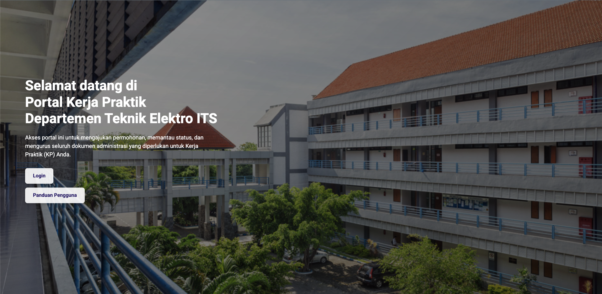

## Project Overview

The Kerja Praktik Management System is an ongoing academic software project developed for Institut Teknologi Sepuluh Nopember (ITS) Surabaya, one of Indonesia's premier technical universities. This comprehensive platform digitizes and streamlines the entire internship (Kerja Praktik) process, from student applications and company placements to supervision, progress monitoring, and final evaluations. Built with Laravel and designed using Figma, the system serves three distinct user roles - students (mahasiswa), lecturers (dosen), and administrative staff (admin TU) - each with customized interfaces and workflows optimized for their specific responsibilities in the internship management lifecycle.

## Academic Context & Problem Statement

### Understanding Kerja Praktik at ITS Surabaya

**What is Kerja Praktik?**

Kerja Praktik (KP) is a mandatory academic requirement where students undertake practical work experience at companies or organizations for 1-3 months, applying theoretical knowledge to real-world problems. This is a critical component of engineering education in Indonesia.

**Traditional Process Challenges**

Before this system, ITS Surabaya's internship management involved:

- **Manual Paper-Based Applications** – Students submitting physical forms and documents
- **Email Coordination** – Back-and-forth emails for approvals and updates
- **Spreadsheet Tracking** – Excel sheets for monitoring student placements
- **Physical Meetings** – In-person consultations with supervisors
- **Document Chaos** – Lost paperwork and missing submission records
- **Limited Visibility** – No real-time oversight of internship progress

### Project Objectives

Build a comprehensive digital platform that:

- Automates the internship application and approval workflow
- Provides centralized database of students, companies, and supervisors
- Enables online progress monitoring and reporting
- Facilitates communication between students, lecturers, and administrators
- Generates reports and analytics for academic planning
- Ensures compliance with university regulations and deadlines

### Target Users

**Students (Mahasiswa)**

- 500+ engineering students per academic year
- Need to find internship opportunities, apply, and track progress
- Submit weekly reports and final documentation

**Lecturers (Dosen)**

- 50+ faculty members serving as academic supervisors
- Oversee student progress, review reports, provide guidance
- Evaluate final presentations and assign grades

**Administrative Staff (Admin TU)**

- 5-10 staff managing overall internship operations
- Process applications, coordinate placements, maintain records
- Generate reports for university administration

## Technical Architecture & Development Stack

Modern full-stack application with API-first architecture and professional UI/UX design.

### Core Technology Stack

- **Backend Framework**: Laravel 10 with MVC architecture
- **API Architecture**: RESTful API for frontend-backend separation
- **Database**: MySQL for relational data management
- **Frontend**: Blade templates + Vue.js for interactive components
- **API Documentation**: Postman/Swagger for API endpoint documentation
- **Design Tool**: Figma for comprehensive UI/UX design system
- **Authentication**: Laravel Sanctum for API authentication
- **File Storage**: Laravel Storage with local/S3 support for documents
- **Email Service**: Laravel Mail for notifications and communications

### System Architecture

**API-First Approach**

- RESTful API endpoints for all system operations
- Separation of frontend presentation and backend logic
- Enables future mobile app development
- Standardized JSON responses for consistency
- API versioning for backward compatibility

**Multi-Role Architecture**

- Role-based access control (RBAC) system
- Three distinct user types with different permissions
- Role-specific dashboards and interfaces
- Data visibility scoped by user role
- Hierarchical permission structure

**Design System in Figma**

- Complete UI/UX design before development
- Consistent visual language across all interfaces
- Component library for reusable design elements
- Responsive design for desktop and mobile
- User flow diagrams and wireframes

## Comprehensive Feature Set by User Role

Tailored functionality for each stakeholder in the internship process.

### Student Portal (Mahasiswa)

**Dashboard & Overview**

- **Personalized Dashboard** – Quick view of internship status and upcoming tasks
- **Timeline View** – Visual representation of internship milestones and deadlines
- **Notification Center** – Alerts for approvals, feedback, and important updates
- **Profile Management** – Academic information, contact details, resume

**Internship Application**

- **Company Database** – Browse available internship opportunities
- **Application Form** – Digital submission with document uploads
- **Multiple Applications** – Apply to multiple companies simultaneously
- **Application Tracking** – Monitor application status and responses
- **Document Management** – Upload CV, transcripts, recommendation letters

**Supervision & Progress**

- **Supervisor Assignment** – View assigned academic and company supervisors
- **Progress Reports** – Submit weekly/biweekly progress reports online
- **Logbook Entry** – Daily activity logging and journal
- **Consultation Scheduling** – Book meetings with academic supervisor
- **Feedback Viewing** – Read supervisor comments and guidance

**Deliverables & Completion**

- **Report Upload** – Submit draft and final internship reports
- **Presentation Scheduling** – Schedule final presentation/seminar
- **Document Repository** – Access to guidelines, templates, and forms
- **Evaluation Results** – View grades and feedback from evaluators
- **Completion Certificate** – Download completion certificates

### Lecturer Portal (Dosen)

**Supervision Dashboard**

- **Student Overview** – List of all supervised students with status indicators
- **Workload View** – Number of students assigned and capacity management
- **Calendar Integration** – Consultation schedule and presentation dates
- **Quick Actions** – Approve reports, provide feedback, schedule meetings

**Student Monitoring**

- **Progress Tracking** – Monitor weekly reports and logbook entries
- **Report Review** – Read and comment on student progress reports
- **Status Updates** – Track student internship phases and milestones
- **Alert System** – Notifications for overdue reports or issues
- **Communication** – Direct messaging with students

**Evaluation & Assessment**

- **Report Grading** – Evaluate draft and final reports
- **Presentation Scoring** – Score final presentations with rubric
- **Feedback Provision** – Written feedback and improvement suggestions
- **Grade Submission** – Submit final grades to administrative system
- **Evaluation History** – View past evaluations and grading patterns

**Administrative Functions**

- **Availability Management** – Set supervision capacity and availability
- **Template Library** – Access to evaluation rubrics and guidelines
- **Report Generation** – Export student progress reports for records
- **Student Assignment** – View and manage assigned supervisees

### Administrative Staff Portal (Admin TU)

**Application Management**

- **Application Queue** – Review pending internship applications
- **Approval Workflow** – Multi-step approval process management
- **Document Verification** – Check completeness of submitted documents
- **Company Verification** – Verify and approve company partnerships
- **Bulk Operations** – Process multiple applications efficiently

**Student & Placement Management**

- **Student Database** – Complete records of all students and their status
- **Company Directory** – Maintain database of partner companies
- **Supervisor Assignment** – Match students with appropriate academic supervisors
- **Placement Tracking** – Monitor student placements and company allocations
- **Status Management** – Update student status through internship phases

**Coordination & Communication**

- **Announcement System** – Broadcast important updates to all users
- **Email Campaigns** – Send targeted emails to specific user groups
- **Event Management** – Organize orientation sessions and final presentations
- **Document Distribution** – Share guidelines, forms, and resources

**Reporting & Analytics**

- **Enrollment Reports** – Statistics on internship participation rates
- **Company Analytics** – Popular companies, placement trends, success rates
- **Supervisor Workload** – Distribution of students across lecturers
- **Completion Tracking** – Monitor on-time completions and delays
- **Custom Reports** – Generate reports for university administration
- **Data Export** – Export data to Excel for further analysis

**System Administration**

- **User Management** – Create and manage user accounts
- **Role Assignment** – Assign and modify user roles and permissions
- **Company Management** – Add, edit, and verify partner companies
- **Academic Period Setup** – Configure semesters and deadlines
- **System Configuration** – Set system parameters and business rules
- **Backup Management** – Schedule and verify data backups

## UI/UX Design in Figma

Comprehensive design system ensuring consistent, professional user experience.

### Design Process & Methodology

**User Research**

- Interviews with students, lecturers, and admin staff
- Analysis of existing paper-based workflows
- Identification of pain points and user needs
- Persona development for each user type

**Information Architecture**

- User flow diagrams for key processes
- Sitemap defining system structure
- Navigation hierarchy planning
- Content organization and labeling

**Visual Design**

- **Color Palette** – ITS Surabaya brand colors (blue, white, gold)
- **Typography** – Readable font families for academic context
- **Icon Library** – Consistent iconography throughout system
- **Spacing System** – Grid-based layout with consistent spacing
- **Component Library** – Reusable UI components (buttons, forms, cards)

### Key Design Features

**Responsive Design**

- Desktop-first approach for primary usage
- Tablet and mobile responsive layouts
- Adaptive navigation for different screen sizes
- Touch-friendly interface elements for mobile

**Accessibility**

- WCAG 2.1 AA compliance considerations
- Color contrast ratios for readability
- Keyboard navigation support
- Screen reader friendly structure

**User Experience Enhancements**

- **Intuitive Navigation** – Clear menu structure and breadcrumbs
- **Progress Indicators** – Visual feedback for multi-step processes
- **Empty States** – Helpful guidance when no data is available
- **Loading States** – Clear indication of data fetching
- **Error Messages** – Friendly, actionable error notifications
- **Success Feedback** – Confirmation messages for actions

## Professional Skills Demonstrated

Comprehensive technical and professional capabilities showcased through this academic project.

### Technical Competencies

**Full-Stack Development**

- End-to-end Laravel application development
- RESTful API architecture and implementation
- Frontend development with Blade and Vue.js
- MySQL database design and optimization
- File upload and storage management

**API Development**

- RESTful API design principles
- Token-based authentication implementation
- API documentation and testing
- Request validation and error handling
- API versioning considerations

**UI/UX Design**

- User research and persona development
- Information architecture and user flows
- Visual design and component creation
- Responsive design implementation
- Accessibility considerations

**Software Engineering**

- Requirement analysis and documentation
- System architecture design
- Code organization and best practices
- Version control with Git
- Testing and quality assurance

### Academic Domain Knowledge

**Education System Understanding**

- Indonesian higher education structure
- Internship (Kerja Praktik) requirements and regulations
- Academic supervision and evaluation processes
- University administrative workflows

**Stakeholder Management**

- Working with university staff and faculty
- Understanding diverse user needs
- Gathering and prioritizing requirements
- Communicating technical concepts to non-technical users

## Why This Project Matters for HR Evaluation

### Demonstrates Comprehensive Full-Stack Capabilities

This project proves proficiency in:

- **Complete Development Lifecycle** – From design to API to frontend implementation
- **Modern Tech Stack** – Laravel, RESTful API, Vue.js, Figma
- **Complex Business Logic** – Multi-role system with intricate workflows
- **Real-World Application** – Solving actual university operational challenges

### Shows Professional Design Thinking

The Figma-first approach demonstrates:

- **User-Centered Design** – Research and design before development
- **Professional UI/UX Skills** – Complete design system and component library
- **Stakeholder Collaboration** – Working with multiple user types
- **Design-to-Development Workflow** – Translating designs into functional interfaces

### Highlights Academic & Educational Technology Experience

Working with university context shows:

- **Domain Expertise** – Understanding of Indonesian higher education
- **Complex Stakeholder Management** – Students, faculty, administrators
- **Regulatory Compliance** – Meeting academic requirements and standards
- **Long-term Project Commitment** – Sustained work on ongoing project

### Proves Versatility Across Multiple Roles

The project encompasses:

- **Backend Development** – Laravel API with complex business logic
- **Frontend Development** – Blade templates and Vue.js components
- **UI/UX Design** – Complete Figma design system
- **Database Architecture** – Relational schema with proper normalization
- **API Architecture** – RESTful API design and documentation

> **For HR Professionals**: This ongoing academic project demonstrates a developer who can handle the complete software development lifecycle – from user research and design to API development to frontend implementation. The multi-role system with complex workflows, professional Figma designs, and RESTful API architecture showcases modern full-stack development skills applicable to any industry. The sustained commitment to an ongoing project also demonstrates reliability, perseverance, and ability to see long-term projects through to completion.

## Key Takeaways

### Core Competencies Demonstrated

- **Full-Stack Development** – Laravel backend, Vue.js frontend, complete system ownership
- **API Architecture** – RESTful API design with proper authentication and documentation
- **UI/UX Design** – Professional Figma design system with user research
- **Multi-Role Systems** – Complex permission structures and workflow management
- **Education Technology** – Academic system development with domain expertise
- **Project Management** – Ongoing project with phased development and clear roadmap

### Technical Skills Showcased

- **Backend**: Laravel 10, RESTful API, Laravel Sanctum, MySQL, File Storage
- **Frontend**: Blade Templates, Vue.js, Responsive Design, Figma Implementation
- **Design**: Figma (UI/UX design, prototyping, component libraries)
- **Tools**: Git, Postman, API Documentation, Database Design

### Professional Attributes

- **Ongoing Commitment** – Sustained work on long-term project
- **User-Focused Approach** – Design based on actual user needs and research
- **Systematic Development** – Structured phases from design to deployment
- **Quality Focus** – Professional design system and code standards
- **Collaboration** – Working with university stakeholders and users

## Conclusion: Academic System Development Excellence

The ITS Surabaya Kerja Praktik Management System represents modern academic software development at its best – combining thorough user research, professional UI/UX design, robust API architecture, and comprehensive full-stack implementation. This ongoing project showcases the ability to handle complex multi-stakeholder systems with intricate workflows while maintaining code quality, design consistency, and user experience standards.

Working on an academic management system for a prestigious university like ITS Surabaya demonstrates not only technical competence but also the ability to understand and digitize complex institutional processes. The Figma-first design approach, RESTful API architecture, and multi-role system design reflect professional-level software engineering practices applicable across industries.

**Key Takeaway**: Developing comprehensive internship management system for ITS Surabaya with Laravel backend, RESTful API architecture, and professionally designed Figma interfaces serving three distinct user roles (students, lecturers, administrators). The ongoing project demonstrates full-stack development capabilities from user research and UI/UX design through API development to frontend implementation, handling complex academic workflows and multi-stakeholder requirements in education technology.
